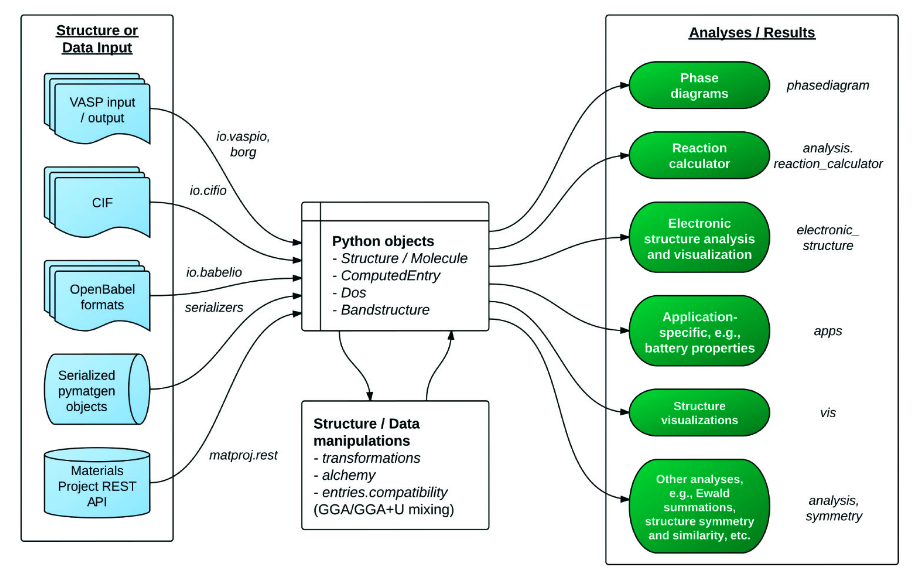

***¡Hola a todos!***

VASP计算运行流程简单示意图：

````mermaid
flowchart LR
	input{{input_file}} 
	vasp(vasp)
	converged(converged)
	raw_data(raw_data)
	
	subgraph prep_input
	1([INCAR])-->input
	2([KPOINTS])-->input
	3([POSCAR])-->input
	4([POTCAR])-->input
	5([sub_job.script])-->input
	end
	input-->vasp
	subgraph vasp_black_box
	vasp---relax([relax])-->converged
	vasp---scf_calc([scf_calc])-->converged
	vasp---nonscf_calc([nonscf_calc])-->converged
	vasp---ect([......])-->converged
	end
	converged-->raw_data
	subgraph post_processing
	raw_data-->table([table])
	raw_data-->gra([graph])
	raw_data-->animation([animation])
	
	end
````

- 第一步为输入文件的准备，除了准备`INCAR KPOINTS POSCAR POTCAR`这四个VASP必需的输入文件之外，通常使用超算集群的用户还需要准备任务提交脚本`sub_job.script`；

- 第二步为提交运行VASP进行计算，这里可以把软件运算过程当成一个黑匣子，作为使用者的角度，我们无需去了解它是如何迭代计算，只需要更加不同的计算内容，我们能够根据不同的依据来判断计算是否完成，也就是是否收敛；

- 第三步为数据后处理过程，VASP输出的输出一般都不能直接转化成为可用的结果，需要我们进一步去分析电荷文件、波函数文件、`OUTCAR`文件等，从其中得到我们最终可以绘图`or`制表的数据。

### Why pymatgen

完整的计算流程中除了第二步依赖于软件本身，其余的工作都需要花费大量的人力时间来操作。传统操作来讲，输入文件可能用`vim`、`Notepad++`、`VScode`等手动编辑；计算结果的处理除了用插件得到`raw_data`还需要用到`origin`手动作图。

对于少量计算来说，手动的亲力亲为的效率反而更高，但是遇到大量计算的计算操作，比如高通量计算，人的专注度是有限的，很容易就会出问题，老司机踩过的坑就包括但不仅限于以下：
 - 修改后的`POSCAR`，忘记对应修改`POTCAR` 

 - 磁性体系没开`ISPIN`

 - 未收敛的结果继续做自洽计算

 - ......

这些操作看起来非常的离谱，初学VASP的兄弟肯定会说这个太夸张了。相信我，经历过大量计算的老哥们肯定或多或少都踩过类似的坑。

回到正题，why pymatgen？看看下面的图你就知道：



这个是`pymatgen`的功能示意图，不难发现，好像`pymatgen`把我们要干的活都给干了：

- 支持根据计算类型生成输入文件

- 支持识别多种格式的结构文件

- 支持分析计算结果

- ......

配合上`matplotlib`绘图，妥妥的实现整个计算流程脚本自动化：

代码一年写一次，一次用三年。

### 自动生成结构弛豫（优化）输入文件

#### MPRelaxSet Function


