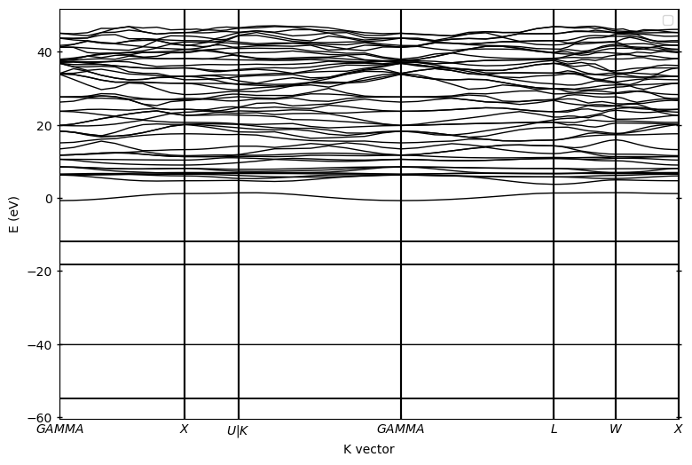
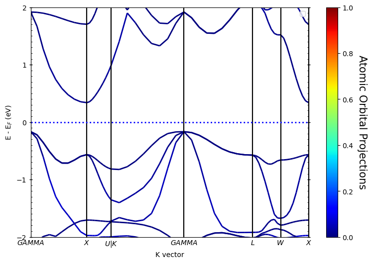
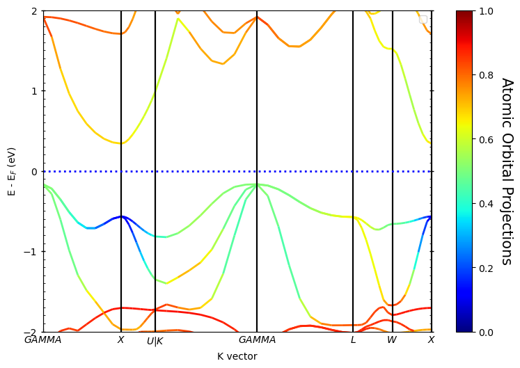
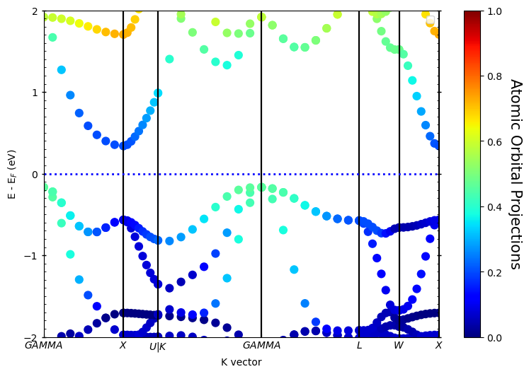
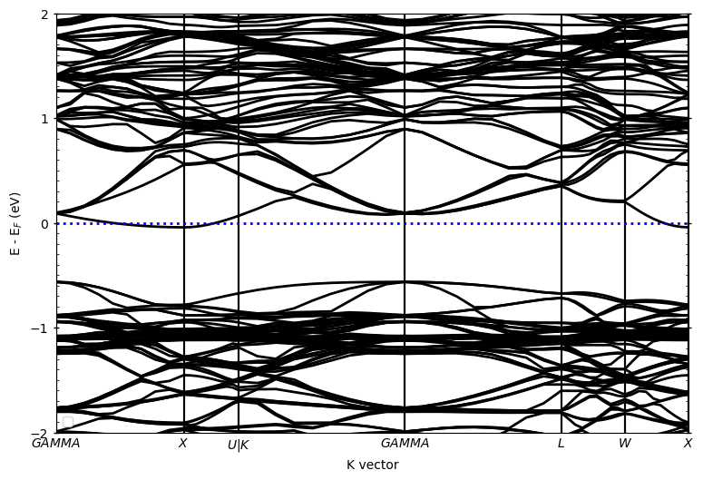
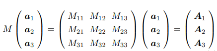

***¡Hola a todos!***

最近学习了一下`Pyprocar`的用法，分享一下使用心得。

对于老司机这种天生反骨的打工人，每天想的都是怎么偷懒，但是又想保住份工，就只能在效率上面想办法了，总之就是：

> **Be lazy, stay efficient, and enjoy your coffee break!**

## 介绍

[官网]([PyProcar — PyProcar 6.1.10 documentation (romerogroup.github.io)](https://romerogroup.github.io/pyprocar/))：

> ***PyProcar is a robust, open-source Python library used for pre- and post-processing of the electronic structure data coming from DFT calculations. PyProcar provides a set of functions that manage data from the PROCAR format obtained from various DFT codes. Basically, the PROCAR file is a projection of the Kohn-Sham states over atomic orbitals. That projection is performed to every 𝑘-point in the considered mesh, every energy band and every atom. PyProcar is capable of performing a multitude of tasks including plotting plain and spin/atom/orbital projected band structures and Fermi surfaces- both in 2D and 3D, Fermi velocity plots, unfolding bands of a super cell, comparing band structures from multiple DFT calculations, plotting partial density of states and generating a 𝑘-path for a given crystal structure.***

简而言之，自动出图，解放双手。而且对比其他后处理软件，老司机个人感觉`Pyprocar`出的图相对来说已经比较好看了，作为工作狗来说妥妥够用不需要二次处理了；放在顶刊文章里可能还需要再编辑下，不过还好`Pyprocar`提供了`matplotlib`再处理的功能，所以对图片要求更加高大上的也不用担心，再次编辑就行了。

## 处理能带

老司机随便找了一篇最近看的文献来部分复现，来更好的介绍相关功能。

> [Significantly improved thermoelectric properties of Nb-doped ZrNiSn half-Heusler compounds - ScienceDirect](https://www.sciencedirect.com/science/article/abs/pii/S1385894722033848?via%3Dihub)

根据文章中的信息，可以在`Materials project`上面找到对应的结构，首先进行常规的结构优化、自洽计算、能带计算操作，老司机这里全程使用`pymatgen`完成，相关操作可以参考老司机的`Learn VASP from pymatgen`系列。

### 原胞体系

#### VASP计算流程

原胞计算代码如下：



<!-- tab 下载结构 -->

```python
from mp_api.client import MPRester

api_key = 'your key'

with MPRester(api_key) as mpr:
    # 获取结构
    structure = mpr.get_structure_by_material_id('mp-924129')
    # 转化成原胞
    primtive_structure = structure.get_primitive_structure()
    # 保存结构
    primtive_structure.to(filename='ZrNiSn_primitive.cif')
```

<!-- endtab -->

<!-- tab 结构优化 -->

```python
from pymatgen.io.vasp.sets import MPRelaxSet
from pymatgen.io.vasp.inputs import Kpoints
from pymatgen.core.structure import Structure
import os

# 结构路径
primtive_cell = './ZrNiSn_primitive.cif'
#自定义INCAR
incar = {
    "ENCUT":400,
    "EDIFF":1E-4,
    "EDIFG":-0.05,
    "ISPIN":1,
    "LORBIT":12, 
}
# 读取结构
struct = Structure.from_file(primtive_cell)
# 生成relax输入
primtive_relax = MPRelaxSet(struct, user_incar_settings=incar, user_potcar_functional='PBE_54')
# 保存
primtive_relax.write_input('./ZrNiSn_primitive/relax')
```

<!-- endtab -->

<!-- tab 自洽计算 -->

```python
from pymatgen.io.vasp.sets import MPStaticSet
import os

# 结构优化文件路径
relax_dir = './ZrNiSn_primitive/relax'
# 自定义INCAR
static_incar = {
    "EDIFF":1E-6,
    "ISMEAR":0,
    "LORBIT":12,
}
# 生成自洽计算输入
primtive_static = MPStaticSet.from_prev_calc(prev_calc_dir=relax_dir,user_incar_settings=static_incar, user_potcar_functional='PBE_54')
# 保存
prim_static.write_input('./ZrNiSn_primitive/static')
```

<!-- endtab -->

<!-- tab 能带计算 -->

```python
from pymatgen.io.vasp.sets import MPNonSCFSet
from pymatgen.symmetry.bandstructure import HighSymmKpath
from pymatgen.core.structure import Structure
from pymatgen.io.vasp.inputs import Kpoints
import os

# 自洽计算路径
static_dir = './ZrNiSn_primitive/static'
# 读取结构
structure = Structure.from_file(os.path.join(static_dir, 'POSCAR'))
# 生成高对称路径
kpath = HighSymmKpath(structure=structure,path_type='hinuma')
# 自动根据高对称路径生成K点
kpoints = Kpoints.automatic_linemode(divisions=10,ibz=kpath)
# 自定义INCAR
band_incar = {
    "EDIFF":1E-6,
    "ISMEAR":0,
    "LORBIT":12,
    "NBANDS":64,
}
# 生成band输入
band = MPNonSCFSet.from_prev_calc(prev_calc_dir=static_dir,user_incar_settings=band_incar,user_kpoints_settings=kpoints,user_potcar_functional='PBE_54')
# 保存
band.write_input('./ZrNiSn_primitive/band')
```

<!-- endtab -->



INCAR中有几点设置需要注意：

- `ISPIN`开关需要根据自己的体系来决定是否考虑自旋；
- `LORBIT`建议全程设置为12，方便后面分析轨道投影能带/态密度。

#### Pyprocar后处理

##### 普通能带

`Pyprocar`的代码非常简单，只需要简单设置就可以得到基本的能带图，主要用到的方法为`pyprocar.bandsplot`。

代码如下：

```python
import pyprocar
from pymatgen.io.vasp.outputs import Vasprun

# 读取vasprun.xml文件
vasprun = Vasprun('./ZrNiSn_primitive/band/vasprun.xml')
# 获取费米能级
efermi=vasprun.efermi
# 打印gap信息
print(vasprun.get_band_structure().get_band_gap())

band_dir = './ZrNiSn_primitive/band'
# pyprocar设置
pyprocar.bandsplot(
    code='vasp',		# 定义计算类型，默认为’vasp'
    dirname=band_dir,	# 指定文件路径，程序会自动读取对应文件
    mode='plain',		# 处理模式，'plain'为绘制普通band
)
```

运行代码：

首先调用`pymatgen`会输出gap信息：

> ***{'direct': False, 'energy': 0.5058999999999987, 'transition': 'GAMMA-X'}***

结构为间接半导体，**VBM→CBM**方向为：**GAMMA→X**，禁带宽度为：**0.5 eV**

默认参数输出的能带图：



ok，此时的能带图初见轮廓但是不利于分析。默认参数下没有平移费米能级至0，已经选择合适的energy interval，所以我们需要优化一下：

```python
import pyprocar
from pymatgen.io.vasp.outputs import Vasprun

# 读取vasprun.xml文件
vasprun = Vasprun('./ZrNiSn_primitive/band/vasprun.xml')
# 获取费米能级
efermi=vasprun.efermi
# 打印gap信息
print(vasprun.get_band_structure().get_band_gap())

band_dir = './ZrNiSn_primitive/band'
# pyprocar设置
pyprocar.bandsplot(
    # 源参数
    code='vasp',		# 定义计算类型，默认为’vasp'
    dirname=band_dir,	# 指定文件路径，程序会自动读取对应文件
    mode='plain',		# 处理模式，'plain'为绘制普通band
    elimit=[-2,2],		# 指定Energy interval
    fermi=efermi,		# 提供费米能级，参数中提供费米能级后，默认会平移至0
    # 绘图参数
    linewidth=[2],		# 曲线宽度
    fermi_linewidth=2	# 费米能级参考线线宽
)
```

运行：


针对上述图片，我们增加了源参数：

- `elimit`：控制纵坐标能量范围；

- `fermi`：提供费米能级

源参数即`pyprocar.bandsplot`读取后输出对应的图，具体参数即含义可[参考文档]([PyProcar — PyProcar 6.1.10 documentation (romerogroup.github.io)](https://romerogroup.github.io/pyprocar/index.html))。参数有很多，但是实际操作中只需要设置几个参数就可以得到非常好的图了。

绘图参数是在此基础上调整图片的线宽，字体大小等，同样也只需要设置有限个参数就可以得到很好的图片了。



> spin_colors : {'description': 'The colors for the plot lines.', 'value': ['blue', 'red']}
>
> color : {'description': 'The colors for the plot lines.', 'value': 'black'}
>
> colorbar_title : {'description': 'Title of the colorbar.', 'value': 'Atomic Orbital Projections'}
>
> colorbar_title_size : {'description': 'Font size of the title of the colorbar.', 'value': 15}
>
> colorbar_title_padding : {'description': 'Padding of the title of the colorbar.', 'value': 20}
>
> colorbar_tick_labelsize : {'description': 'Size of the title of the colorbar ticks', 'value': 10}
>
> cmap : {'description': 'The colormap used for the plot.', 'value': 'jet'}
>
> clim : {'description': 'The color scale for the color bar', 'value': [None, None]}
>
> fermi_color : {'description': 'The color of the Fermi line.', 'value': 'blue'}
>
> fermi_linestyle : {'description': 'The linestyle of the Fermi line.', 'value': 'dotted'}
>
> fermi_linewidth : {'description': 'The linewidth of the Fermi line.', 'value': 1}
>
> grid : {'description': 'If true, a grid will be shown on the plot.', 'value': False}
>
> grid_axis : {'description': 'Which axis (or both) the grid lines should be drawn on.', 'value': 'both'}
>
> grid_color : {'description': 'The color of the grid lines.', 'value': 'grey'}
>
> grid_linestyle : {'description': 'The linestyle of the grid lines.', 'value': 'solid'}
>
> grid_linewidth : {'description': 'The linewidth of the grid lines.', 'value': 1}
>
> grid_which : {'description': 'Which grid lines to draw (major, minor or both).', 'value': 'major'}
>
> label : {'description': 'The labels for the plot lines.', 'value': ['$\\uparrow$', '$\\downarrow$']}
>
> legend : {'description': 'If true, a legend will be shown on the plot.', 'value': True}
>
> linestyle : {'description': 'The linestyles for the plot lines.', 'value': ['solid', 'dashed']}
>
> linewidth : {'description': 'The linewidths for the plot lines.', 'value': [1.0, 1.0]}
>
> marker : {'description': 'The marker styles for the plot points.', 'value': ['o', 'v', '^', 'D']}
>
> markersize : {'description': 'The size of the markers for the plot points.', 'value': [0.2, 0.2]}
>
> opacity : {'description': 'The opacities for the plot lines.', 'value': [1.0, 1.0]}
>
> plot_color_bar : {'description': 'If true, a color bar will be shown on the plot.', 'value': True}
>
> savefig : {'description': 'The file name to save the figure. If null, the figure will not be saved.', 'value': None}
>
> title : {'description': 'The title for the plot. If null, no title will be displayed.', 'value': None}
>
> weighted_color : {'description': 'If true, the color of the lines will be weighted.', 'value': True}
>
> weighted_width : {'description': 'If true, the width of the lines will be weighted.', 'value': False}
>
> figure_size : {'description': 'The size of the figure (width, height) in inches.', 'value': [9, 6]}
>
> dpi : {'description': "The resolution in dots per inch. If 'figure', use the figure's dpi value.", 'value': 'figure'}



##### 轨道投影能带图

###### 线性

`LORBIT`设置成12的话，轨道的分类如下：


此时`pyprocar.bandsplot`中设置`mode=parametric`，同时也需要指定轨道：

- `orbitals=[1]`：只分析`py`亚轨道；
- `orbitals=[1,2,3]`：分析全部p轨道;
- 以此类推......

下面为primtive_cell的结果：



<!-- tab s轨道 -->

```python
import pyprocar
from pymatgen.io.vasp.outputs import Vasprun

# 读取vasprun.xml文件
vasprun = Vasprun('./ZrNiSn_primitive/band/vasprun.xml')
efermi = vasprun.efermi

band_dir = './ZrNiSn_primitive/band'

pyprocar.bandsplot(
    code='vasp',
    dirname=band_dir,
    mode='parametric',
    elimit=[-2,2],
    orbitals=[0],   # s轨道
    fermi=efermi,
    clim=[0,1],		# color bar的刻度
    linewidth=[2],
    fermi_linewidth=2
)
```

运行代码：



<!-- endtab -->

<!-- tab p轨道 -->

```python
import pyprocar
from pymatgen.io.vasp.outputs import Vasprun

# 读取vasprun.xml文件
vasprun = Vasprun('./ZrNiSn_primitive/band/vasprun.xml')
efermi = vasprun.efermi

band_dir = './ZrNiSn_primitive/band'

pyprocar.bandsplot(
    code='vasp',
    dirname=band_dir,
    mode='parametric',
    elimit=[-2,2],
    orbitals=[1,2,3],   # p轨道
    fermi=efermi,
    clim=[0,1],			# color bar的刻度
    linewidth=[2],
    fermi_linewidth=2
)
```

运行代码：


<!-- endtab -->

<!-- tab d轨道 -->

```python
import pyprocar
from pymatgen.io.vasp.outputs import Vasprun

# 读取vasprun.xml文件
vasprun = Vasprun('./ZrNiSn_primitive/band/vasprun.xml')
efermi = vasprun.efermi

band_dir = './ZrNiSn_primitive/band'

pyprocar.bandsplot(
    code='vasp',
    dirname=band_dir,
    mode='parametric',
    elimit=[-2,2],
    orbitals=[4,5,6,7,8],   # d轨道
    fermi=efermi,
    clim=[0,1],				# color bar的刻度
    linewidth=[2],
    fermi_linewidth=2
)
```

运行代码：



<!-- endtab -->



如果是对于自旋体系，在源参数中增加`spins`即可控制绘图考虑的自旋方向：

- `spins=[0]`：绘制spin up
- `spins=[1]`：绘制spin down
- `spins=[0,1]`：同时绘制spin up & spin down

老司机这里计算的时候把自旋关了，所以输出也就只有一条，不用额外设置。

除此之外，还可以输出原子的贡献，操作就是把`oribitals`换成`atoms`，如下：

```python
import pyprocar
from pymatgen.io.vasp.outputs import Vasprun

# 读取vasprun.xml文件
vasprun = Vasprun('./ZrNiSn_primitive/band/vasprun.xml')
efermi = vasprun.efermi

band_dir = './ZrNiSn_primitive/band'

pyprocar.bandsplot(
    code='vasp',
    dirname=band_dir,
    mode='parametric',
    elimit=[-2,2],
    atoms=[0],   			# 1号原子贡献
    fermi=efermi,
    clim=[0,1],				# color bar的刻度
    linewidth=[2],
    fermi_linewidth=2
)
```

运行代码：


如果想得到某一元素的贡献，只需要在`atoms=[]`中包含同一元素原子所有的序号即可，上面计算用到的primtive cell中每个元素只有一个原子，即上图为`Zr`元素的贡献。

###### 散点

还可以用散点来表示，差别只是把`mode='parametric`'换成`mode='scatter'`，其余设置一样，如下：

```python
import pyprocar
from pymatgen.io.vasp.outputs import Vasprun

# 读取vasprun.xml文件
vasprun = Vasprun('./ZrNiSn_primitive/band/vasprun.xml')
efermi = vasprun.efermi

band_dir = './ZrNiSn_primitive/band'

pyprocar.bandsplot(
    code='vasp',
    dirname=band_dir,
    mode='scatter',
    elimit=[-2,2],
    atoms=[0],   			# 1号原子贡献
    fermi=efermi,
    clim=[0,1],				# color bar的刻度
    markersize=[60],		# 调整散点大小
    fermi_linewidth=2
)
```

运行代码：



### 掺杂体系

掺杂体系在原胞基础上进行3x3x3超胞，然后随机替换一个Zr原子为Nb原子，此时的掺杂率为0.037% ≈ 0.04%

#### VASP计算流程



<!-- tab 构建超胞 -->

```python
from pymatgen.core.structure import Structure

pris_primtive = Structure.from_file('./ZrNiSn_primitive.cif')

# 超胞3x3x3
supercell = pris_primtive.copy()
supercell.make_supercell([3, 3, 3])
supercell.to(filename='ZrNiSn_supercell_3x3x3.cif')
```

<!-- endtab -->

<!-- tab 掺杂 -->

```python
from pymatgen.core.structure import Structure
import random

structure = Structure.from_file('./ZrNiSn_supercell_3x3x3.cif')
# 指定要替换的元素和掺杂的元素
original_element = "Zr"
dopant_element = "Nb"

# 找到所有 Pb 原子的位置
pb_sites = [i for i, site in enumerate(structure) if site.species_string == original_element]

# 随机选择一个 Pb 原子位置进行替换
index_to_replace = random.choice(pb_sites)

# 生成掺杂结构
doped_structure = structure.copy()
doped_structure.replace(index_to_replace, dopant_element)

# 保存掺杂结构
doped_structure.to("Zr0.96Nb0.04NiSn.cif")
```

<!-- endtab -->

<!-- tab 优化结构 -->

```python
from pymatgen.io.vasp.sets import MPRelaxSet
from pymatgen.io.vasp.inputs import Kpoints
from pymatgen.core.structure import Structure
import os

# 结构路径
doped_structure = './Zr0.96Nb0.04NiSn.cif'
#自定义INCAR
incar = {
    "ENCUT":400,
    "EDIFF":1E-4,
    "EDIFG":-0.05,
    "ISPIN":1,
    "LORBIT":12, 
}
# 读取结构
struct = Structure.from_file(doped_structure)
# 生成relax输入
doped_relax = MPRelaxSet(struct, user_incar_settings=incar, user_potcar_functional='PBE_54')
# 保存
doped_relax.write_input('./Zr0.96Nb0.04NiSn/relax')
```

<!-- endtab -->

<!-- tab 自洽计算 -->

```python
from pymatgen.io.vasp.sets import MPStaticSet
import os

doped_relax_dir = './Zr0.96Nb0.04NiSn/relax'

static_incar = {
    "EDIFF":1E-6,
    "ISMEAR":0,
    "LORBIT":12,
}
doped_static = MPStaticSet.from_prev_calc(prev_calc_dir=doped_relax_dir,user_incar_settings=static_incar, user_potcar_functional='PBE_54')
doped_static.write_input('./Zr0.96Nb0.04NiSn/static')
```

<!-- endtab -->

<!-- tab 能带计算 -->

```python
from pymatgen.io.vasp.sets import MPNonSCFSet
from pymatgen.symmetry.bandstructure import HighSymmKpath
from pymatgen.core.structure import Structure
from pymatgen.io.vasp.inputs import Kpoints
import os

doped_static_dir = './Zr0.96Nb0.04NiSn/static'

structure = Structure.from_file(os.path.join(doped_static_dir, 'POSCAR'))

kpath = HighSymmKpath(structure=structure,path_type='hinuma')   

kpoints = Kpoints.automatic_linemode(divisions=10,ibz=kpath)

band_incar = {
    "EDIFF":1E-6,
    "ISMEAR":0,
    "LORBIT":12,
    "NBANDS":1360,
}

doped_band = MPNonSCFSet.from_prev_calc(prev_calc_dir=static_dir,user_incar_settings=band_incar,user_kpoints_settings=kpoints,user_potcar_functional='PBE_54')

doped_band.write_input(os.path.join('./Zr0.96Nb0.04NiSn/band'))
```

<!-- endtab -->



#### Pyprocar后处理

常规画图代码与原胞体系类似，只需要修改下读取的`band`计算的文件夹。

掺杂体系普通能带图如下：



由于扩胞后发生了能带折叠现象，不作任何处理的掺杂体系的能带特征与原胞相差甚远。而`Pyprocar`提供了能带反折叠的方法，我们来试一下看看效果如何。

##### 能带反折叠

注意！此时`supercell`需要重新计算能带，且能带计算的KPOINTS文件也需要相应的调整：



上图中 `a` 和 `A` 分别表示原胞和超胞的基矢，`M`为变化矩阵，在本案例中：

$$
\
M = \begin{bmatrix}
3 & 0 & 0 \\\\
0 & 3 & 0 \\\\
0 & 0 & 3 
\end{bmatrix}
\
$$

同时对应的通过矩阵变化修改`supercell`倒易空间的K向量坐标，生成新的`KPOINTS`，然后再算一次非自洽过程。

然后用`pyprocar.unfold`方法处理结果：

```python
from pyprocar
import numpy as np

band_dir = './Zr0.96Nb0.04NiSn/band'

pyprocar.unfold(
    code='vasp',
    dirname=band_dir,
    mode='plain',
    unfold_mode='both',
    fermi=9.10898299,
    supercell_matrix=np.diag([3, 3, 3]),
    elimit=[-2,2],
)
```

## 处理态密度

态密度的处理方法与能带类似，使用`pyprocar.dosplot`
