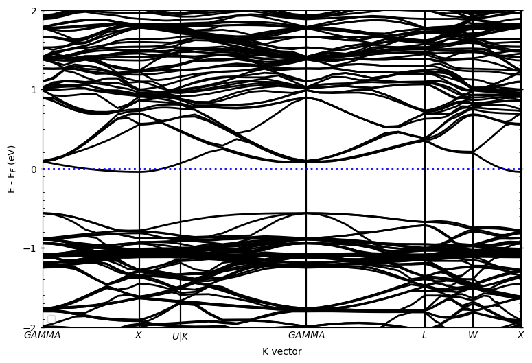

### 掺杂体系

掺杂体系在原胞基础上进行3x3x3超胞，然后随机替换一个Zr原子为Nb原子，此时的掺杂率为0.037% ≈ 0.04%

#### VASP计算流程



<!-- tab 构建超胞 -->

```python
from pymatgen.core.structure import Structure

pris_primtive = Structure.from_file('./ZrNiSn_primitive.cif')

# 超胞3x3x3
supercell = pris_primtive.copy()
supercell.make_supercell([3, 3, 3])
supercell.to(filename='ZrNiSn_supercell_3x3x3.cif')
```

<!-- endtab -->

<!-- tab 掺杂 -->

```python
from pymatgen.core.structure import Structure
import random

structure = Structure.from_file('./ZrNiSn_supercell_3x3x3.cif')
# 指定要替换的元素和掺杂的元素
original_element = "Zr"
dopant_element = "Nb"

# 找到所有 Pb 原子的位置
pb_sites = [i for i, site in enumerate(structure) if site.species_string == original_element]

# 随机选择一个 Pb 原子位置进行替换
index_to_replace = random.choice(pb_sites)

# 生成掺杂结构
doped_structure = structure.copy()
doped_structure.replace(index_to_replace, dopant_element)

# 保存掺杂结构
doped_structure.to("Zr0.96Nb0.04NiSn.cif")
```

<!-- endtab -->

<!-- tab 优化结构 -->

```python
from pymatgen.io.vasp.sets import MPRelaxSet
from pymatgen.io.vasp.inputs import Kpoints
from pymatgen.core.structure import Structure
import os

# 结构路径
doped_structure = './Zr0.96Nb0.04NiSn.cif'
#自定义INCAR
incar = {
    "ENCUT":400,
    "EDIFF":1E-4,
    "EDIFG":-0.05,
    "ISPIN":1,
    "LORBIT":12, 
}
# 读取结构
struct = Structure.from_file(doped_structure)
# 生成relax输入
doped_relax = MPRelaxSet(struct, user_incar_settings=incar, user_potcar_functional='PBE_54')
# 保存
doped_relax.write_input('./Zr0.96Nb0.04NiSn/relax')
```

<!-- endtab -->

<!-- tab 自洽计算 -->

```python
from pymatgen.io.vasp.sets import MPStaticSet
import os

doped_relax_dir = './Zr0.96Nb0.04NiSn/relax'

static_incar = {
    "EDIFF":1E-6,
    "ISMEAR":0,
    "LORBIT":12,
}
doped_static = MPStaticSet.from_prev_calc(prev_calc_dir=doped_relax_dir,user_incar_settings=static_incar, user_potcar_functional='PBE_54')
doped_static.write_input('./Zr0.96Nb0.04NiSn/static')
```

<!-- endtab -->

<!-- tab 能带计算 -->

```python
from pymatgen.io.vasp.sets import MPNonSCFSet
from pymatgen.symmetry.bandstructure import HighSymmKpath
from pymatgen.core.structure import Structure
from pymatgen.io.vasp.inputs import Kpoints
import os

doped_static_dir = './Zr0.96Nb0.04NiSn/static'

structure = Structure.from_file(os.path.join(doped_static_dir, 'POSCAR'))

kpath = HighSymmKpath(structure=structure,path_type='hinuma')   

kpoints = Kpoints.automatic_linemode(divisions=10,ibz=kpath)

band_incar = {
    "EDIFF":1E-6,
    "ISMEAR":0,
    "LORBIT":12,
    "NBANDS":1360,
}

doped_band = MPNonSCFSet.from_prev_calc(prev_calc_dir=static_dir,user_incar_settings=band_incar,user_kpoints_settings=kpoints,user_potcar_functional='PBE_54')

doped_band.write_input(os.path.join('./Zr0.96Nb0.04NiSn/band'))
```

<!-- endtab -->



#### Pyprocar后处理

常规画图代码与原胞体系类似，只需要修改下读取的`band`计算的文件夹。

掺杂体系普通能带图如下：



由于扩胞后发生了能带折叠现象，不作任何处理的掺杂体系的能带特征与原胞相差甚远。而`Pyprocar`提供了能带反折叠的方法，我们来试一下看看效果如何。

##### 能带反折叠

注意！此时`supercell`需要重新计算能带，且能带计算的KPOINTS文件也需要相应的调整：


上图中 `a` 和 `A` 分别表示原胞和超胞的基矢，`M`为变化矩阵，在本案例中：

$$
\
M = \begin{bmatrix}
3 & 0 & 0 \\\\
0 & 3 & 0 \\\\
0 & 0 & 3 
\end{bmatrix}
\
$$

同时对应的通过矩阵变化修改`supercell`倒易空间的K向量坐标，生成新的`KPOINTS`，然后再算一次非自洽过程。

然后用`pyprocar.unfold`方法处理结果：

```python
from pyprocar
import numpy as np

band_dir = './Zr0.96Nb0.04NiSn/band'

pyprocar.unfold(
    code='vasp',
    dirname=band_dir,
    mode='plain',
    unfold_mode='both',
    fermi=9.10898299,
    supercell_matrix=np.diag([3, 3, 3]),
    elimit=[-2,2],
)
```
