`Atomate2`​安装过程[官网](https://materialsproject.github.io/atomate2/user/install.html)上介绍的已经非常详细了，唯一需要注意的是云数据库的设置。`Atomate2`​推荐采用云数据库来存储工作量计算结果，官网给出的例子为使用`Mongdb Atlas`​。但是由于一些原因，采用云数据库来储存数据，对于个人用户来说不是很友好，特别是国内用户：

* 由于“局域网”问题，许多集群可能连接不上`Mongdb Atlas`​，或者速度比较慢，容易掉线；
* 云数据库要花钱购买存储空间，`Mongdb Atlas`​也只提供500M的免费空间，长期来看也是不够用的，不管你是学生还是社畜，咱自己总不能倒贴上班吧；
* 小批量计算没有这个必要，个人用户自己计算的东西，体量实在太小，没必要纠结于按照官网教程来配置数据库，我们主要是使用`Atomate2`​方便的工作流。

**Note：** 当然，如果你单位有这个条件搭建数据库，那自然是更好的QAQ。

采用本地读取数据，实际上官网上也给出了相应的介绍，只需要把对应的`jobflow.yaml`​文件设置成以下格式：

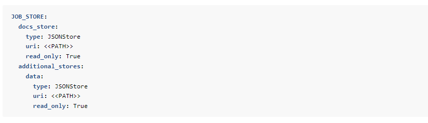

‍

自此，假设你已经完成了`pymatgen`​的配置（`pymatgen`​的配置之前出过详细的教程，可查看往期内容），`Atomate2`​的配置，那么接下来就可以正式进入`Atomate2`​的实操了。

## Atomate2可运行任务&工作流类型

下表为`Atomate2`​已经为你预制的计算类型，实际使用时只需要进行调用即可：

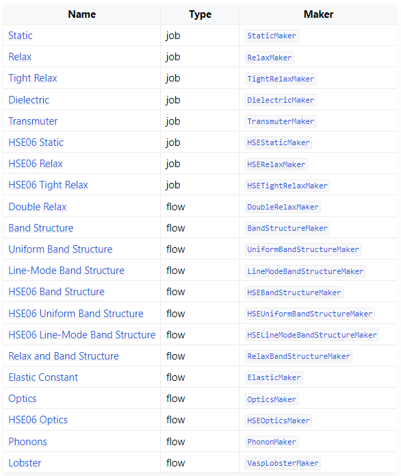

根据任务`Type`​不同，`job`​任务的调用为：

```python
from atomate2.vasp.jobs.core import *
```

`flow`​任务的调用为：

```python
from atomate2.vasp.flows.core import *
```

除此上述“基本”的工作流之外，`Atomate2`​还有相对复杂的工作流，例如：

```python
from atomate2.vasp.flows.adsorption import AdsorptionMaker
```

这是一个计算吸附能的工作流，具体流程为：

> The flow consists of the following steps:
>
> 1. Optimize the molecule structure and calculate its static energy.
> 2. Optimize the bulk structure.
> 3. Generate a slab structure using the optimized bulk structure and calculate its static energy.
> 4. Generate adsorption sites on the slab and calculate corresponding static energy.
> 5. Calculate the adsorption energy by calculating the energy difference between the slab with adsorbed molecule and the sum of the slab without the adsorbed molecule and the molecule.

吸附能工作流相对来说比较复杂，涉及到多步计算以及结构变化操作，工作流中的每一个`task`​的参数设置都要格外小心，相对于上述“基本”工作流而言，属于“进阶”工作流，如果用好了的话会非常方便，当然也有它的使用局限性，我们后面再介绍。

## 工作流的组成

本小节是本篇内容的核心部分。

`Atomate2`​给出的工作流中，关键参数是已经提供了默认值的，例如之前给出得例子：

```python
from atomate2.vasp.flows.core import RelaxBandStructureMaker
from jobflow.managers.local import run_locally
from pymatgen.core import Structure

si_structure = Structure(
    lattice=[[0, 2.73, 2.73], [2.73, 0, 2.73], [2.73, 2.73, 0]],
    species=["Si", "Si"],
    coords=[[0, 0, 0], [0.25, 0.25, 0.25]],
)

bandstructure_flow = RelaxBandStructureMaker().make(si_structure)

run_locally(bandstructure_flow, create_folders=True)
```

算`Si`​的能带态密度结构，直接按照上面的代码提交任务进行`vasp`​计算，计算完成后可以在当前路径下找到五个文件夹：

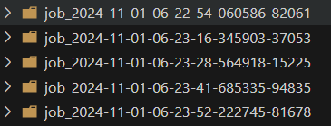

我们找到`RelaxBandStructureMaker`​的文档注释看一下：

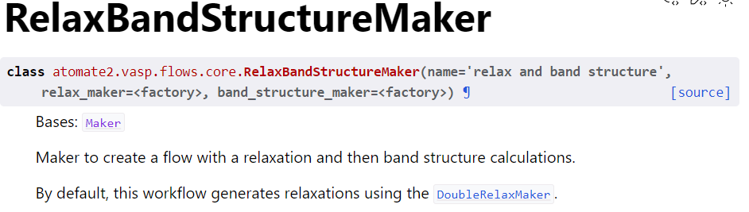

实际上，`RelaxBandStructureMaker`​是调用了`relax_maker`​和`band_structure_maker`​，然后查看源代码可以发现：

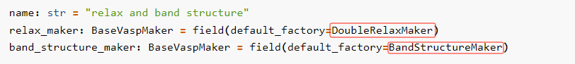

工作流结构优化部分是调用了`DoubleRelaxMaker`​，能带结构分析调用了`BandStructureMaker`​，继续顺藤摸瓜：

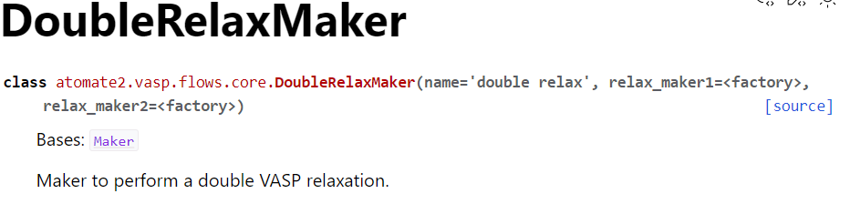

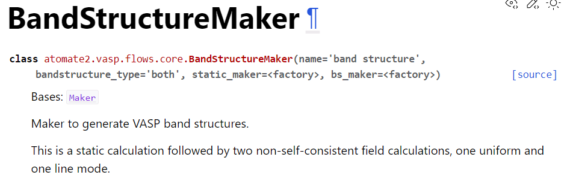

可以发现，`DoubleRelaxMaker`​进行了两个结构优化任务，`BandStructureMaker`​进行了一个静态自洽计算，两个非自洽计算，这也是为什么计算完成后会有5个计算文件夹。

计算文件夹命名可以根据时间来区分，即自上而下分别是：第一次结构优化、第二次结构优化、静态自洽、uniform 非自洽计算、line 非自洽计算。

​

**Note：** 上述uniform 非自洽计算即态密度计算，line 非自洽计算才是能带计算结果。可以在`bandstructure_type`​中选择计算哪种或者都计算。

回到计算结果，`Atomate2`​计算完成后，对于顺利结束的任务，会自动打包为`.gz`​格式的文件；反之，如果任务有`ERROR`​或`WARNING`​之类，则不会打包文件。

上述计算中，结果优化与静态自洽计算都正常结束，后两步非自洽计算都出现了报错，报错内容可以在每个文件夹中`custodian.json`​文件中查看：

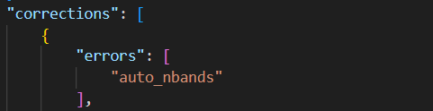

实际上这个`error`​就是`INCAR`​中`NBANDS`​设置有误，但是在实际计算中由于`VASP`​可以自行调整部分参数：

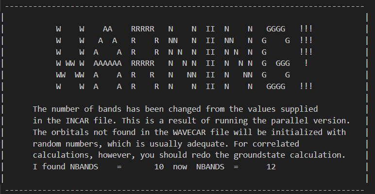

实际上计算也是可以正常结束的。

但是这不意味着在实际使用过程中可以信赖默认的参数，最稳妥以及保险的做法，还是要自定义输入参数！

## 自定义输入参数

通过查看`Atomate2`​的文档说明，实际上`Atomate2`​的输入参数也是直接调用的`pymatgen`​的各类`sets`​的默认输入，可以去`pymatgen`​源代码中查看yaml格式文件[Link](https://github.com/materialsproject/pymatgen/tree/master/src/pymatgen/io/vasp)。

还有一点需要注意，随着`VASP`​的更新，`pymatgen`​的`sets`​的默认参数也会更新。在`Atomate2`​里面，`relax`​操作调用的是`pymatgen`​中的`MPSCANRelaxSet`​的默认输入，其中部分`INCAR`​词条的设置只适用于`VASP 6+`​版本，如果你使用的还是`VASP 5.4.4`​版本的话，推荐在`Atomate2`​使用中还是使用`MPRelaxSet`​，下面会详细说明。

回到上述`Si`​单质计算能带态密度工作流的案例，下面将详细的说明在每一步里面如何合理的自定义输入参数：

* relax步骤

以`RelaxMaker`​为例，主要是需要区分`input_set_generator`​和`write_input_set_kwargs`​的区别，其余的设置都可以采用默认。

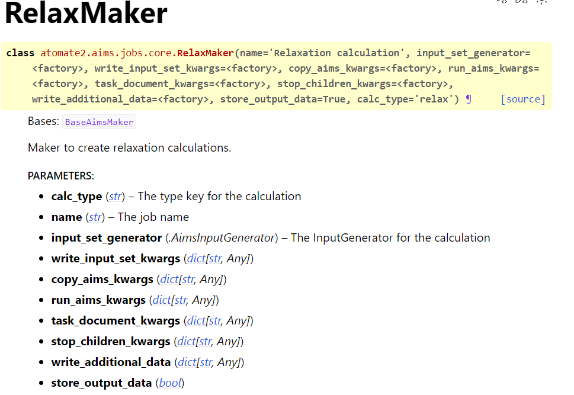

通俗的来讲，`input_set_generator`​控制输入文件的设置，可以约等于`set`​类，如`MPRelaxSet`​；而`write_input_set_kwargs`​可传入的参数更多，可以传`input_set_generator`​、`structure`​、`output_path`​等等，自由度更高。但是目前来说，只修改`input_set_generator`​就可以满足绝大多数使用场景了。

由于本人使用的是`VASP 5.4.4`​，这里重新调用了`pymatgen`​的`MPRelaxSet`​来生成输入

```python
# relax
relax_input_set = MPRelaxSet(user_incar_settings={"ENCUT":None, "ISPIN":1, "LCHARG":False})
relax_maker = RelaxMaker(input_set_generator=relax_input_set)

# static
static_input_set = MPStaticSet(user_incar_settings={"ENCUT":None,  "ISPIN":1, "LCHARG":True})
static_maker = StaticMaker(input_set_generator=static_input_set)

# nonscf
nsf_input_set = MPNonSCFSet(user_incar_settings={"ENCUT":None, "NBANDS":None, "ISPIN":1, "LCHARG":False})
nsf_maker = NonSCFMaker(input_set_generator=nsf_input_set)
```

**Note：**​`relax`​步骤只采取了一步优化，所以对应的最后输出的计算文件夹个数只有四个。

上面针对所有的计算`task`​的输入进行了自定义，然后就是进行组合：

```python
# bandstrucure_maker
band_maker = BandStructureMaker(static_maker=static_maker,bs_maker=nsf_maker)

# relaxbandstructure_flow
relaxbandstructure_flow = RelaxBandStructureMaker(relax_maker=relax_maker,band_structure_maker=band_maker).make(si_structure)
```

至此，整个工作流的输入实现了自定义。关于`sets`​类的参数设置可以参考本人之前写的`pymatgen`​教程。

完整代码如下：

```python
from atomate2.vasp.jobs.core import RelaxMaker, StaticMaker, NonSCFMaker
from atomate2.vasp.flows.core import RelaxBandStructureMaker, BandStructureMaker
from pymatgen.io.vasp.sets import MPRelaxSet, MPStaticSet, MPNonSCFSet
from jobflow import run_locally, JobStore, SETTINGS
from pymatgen.core import Structure
import os

work_dir = os.getcwd()

si_structure = Structure(
    lattice=[[0, 2.73, 2.73], [2.73, 0, 2.73], [2.73, 2.73, 0]],
    species=["Si", "Si"],
    coords=[[0, 0, 0], [0.25, 0.25, 0.25]],
)

# 自定义输入设置
relax_input_set = MPRelaxSet(user_incar_settings={"ENCUT":None, "ISPIN":1, "LCHARG":False})
static_input_set = MPStaticSet(user_incar_settings={"ENCUT":None,  "ISPIN":1, "LCHARG":True})
nsf_input_set = MPNonSCFSet(user_incar_settings={"ENCUT":None, "NBANDS":None, "ISPIN":1, "LCHARG":False})

# 传入maker
relax_maker = RelaxMaker(input_set_generator=relax_input_set)
static_maker = StaticMaker(input_set_generator=static_input_set)
nsf_maker = NonSCFMaker(input_set_generator=nsf_input_set)
band_maker = BandStructureMaker(static_maker=static_maker,bs_maker=nsf_maker)

# 定义工作流
relaxbandstructure_flow = RelaxBandStructureMaker(relax_maker=relax_maker,band_structure_maker=band_maker).make(si_structure)

# 运行工作流
run_locally(relaxbandstructure_flow, create_folders=True)
```

运行方法：如果是个人电脑上运行，可以直接`python relaxband.py`​运行上述脚本；如果是在集群上，需要修改下提交脚本，下面以`slurm`​作业调度系统为例：

```shell
#!/bin/bash
#SBATCH -J relaxband
#SBATCH -p long
#SBATCH --ntasks-per-node=32
#SBATCH --time=2400:00:00
#SBATCH --nodes=1
#SBATCH --output=%j.log

# 加载VASP
module load /path/vasp

# 进入atomate2环境
source activate atomate2
# 运行脚本
python relaxband.py &>output
```

计算完成后，当前路径下会生成四个文件夹，分别是：结构优化、静态计算、态密度计算、能带计算：

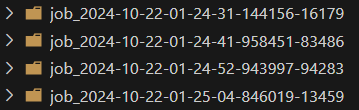

工作流的参数自定义大致操作就是这样。学会举一反三，对于其他类型工作流的参数自定义设置也类似，想要进一步的去理解和个性化设置，鼓励各位还是要去看看文档和源代码。

## 工作流JSON文件

`Atomate2`​在工作流计算完成后，会生成`doc`​文档来记录部分计算结果，具体设置由`jobflow.yaml`​文件控制。需要说明的是，如果采用云数据库的话，除了`doc`​文档的话还会有`data`​文件来储存数据，如上述`relaxbandstructure`​工作流最后得到态密度和能带可以直接从`data`​里面读取，而不需要从`VASP`​的输出文件：`OUTCAR`​或`vasprun.xml`​文件中进行后处理。

但是，如果采用的是本地储存的话，实际上`data`​文件是为空的，本人也暂时不知道为啥，官方论坛上也暂时检索不到解决办法，具体报错内容为：`WARNING Response.stored_data is not supported with local manager`​。如果有大佬知道如何解决，可以分享一下。

但是无论如何，即使没有`data`​文件，大不了通过处理`OUTCAR`​或`vasprun.xml`​来得到相关数据，从结果上来没有什么区别。

这里简单介绍一下`doc`​文档，`doc`​文档的路径即`jobflow.yaml`​中给定的路径，文件格式为`JSON`​格式，官网上对文档的结构有详尽的介绍：[Link](https://materialsproject.github.io/atomate2/user/docs_schemas_emmet.html)。这里不赘述。

主要是针对计算时的操作给出一点建议。如果我们有多个结构需要进行`relaxbandstructure`​工作流计算，按照上述代码结构批量提交了之后，我们最终得到的`doc`​文档是所有结构工作流的信息，也就是`doc`​文档不会去根据任务数量在`jobflow.yaml`​中定义的路径下针对不同的任务新建不同的`doc`​，而是在原有的`doc`​文档末尾添加新的信息，久而久之，`doc`​文档会非常冗长，可读性差。所以，建议把`doc`​文档保存在每个工作流目录下，只需要在上述代码中做如下修改：

```python
from atomate2.vasp.jobs.core import RelaxMaker, StaticMaker, NonSCFMaker
from atomate2.vasp.flows.core import RelaxBandStructureMaker, BandStructureMaker
from pymatgen.io.vasp.sets import MPRelaxSet, MPStaticSet, MPNonSCFSet
from jobflow import run_locally, JobStore, SETTINGS
from pymatgen.core import Structure
import os

work_dir = os.getcwd()

si_structure = Structure(
    lattice=[[0, 2.73, 2.73], [2.73, 0, 2.73], [2.73, 2.73, 0]],
    species=["Si", "Si"],
    coords=[[0, 0, 0], [0.25, 0.25, 0.25]],
)

# 自定义输入设置
relax_input_set = MPRelaxSet(user_incar_settings={"ENCUT":None, "ISPIN":1, "LCHARG":False})
static_input_set = MPStaticSet(user_incar_settings={"ENCUT":None,  "ISPIN":1, "LCHARG":True})
nsf_input_set = MPNonSCFSet(user_incar_settings={"ENCUT":None, "NBANDS":None, "ISPIN":1, "LCHARG":False})

# 传入maker
relax_maker = RelaxMaker(input_set_generator=relax_input_set)
static_maker = StaticMaker(input_set_generator=static_input_set)
nsf_maker = NonSCFMaker(input_set_generator=nsf_input_set)
band_maker = BandStructureMaker(static_maker=static_maker,bs_maker=nsf_maker)

# 定义工作流
relaxbandstructure_flow = RelaxBandStructureMaker(relax_maker=relax_maker,band_structure_maker=band_maker).make(si_structure)

# 工作流文件夹
relaxband_dir = os.path.join(work_dir, "relaxband")
os.makedirs(relaxband_dir, exist_ok=True)

# 新建docs和data文件夹存储doc文档和data数据
docs_path = os.path.join(relaxband_dir, "docs")
data_path = os.path.join(relaxband_dir, "data")
os.makedirs(docs_path, exist_ok=True)
os.makedirs(data_path, exist_ok=True)

# 替换jobflow.yaml文件中的路径
SETTINGS.JOB_STORE.docs_store.paths = [os.path.join(docs_path,'doc.json')]
SETTINGS.JOB_STORE.additional_stores['data'].paths = [os.path.join(data_path,'data.json')]

# 运行工作流
run_locally(relaxbandstructure_flow, create_folders=True, root_dir=relaxband_dir)
```

最终可以在工作流文件夹下生成对应的`doc`​文档和`data`​数据文件夹，实现每个工作流的信息独立存储：

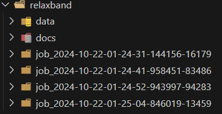

‍

**To be continued......**

‍
