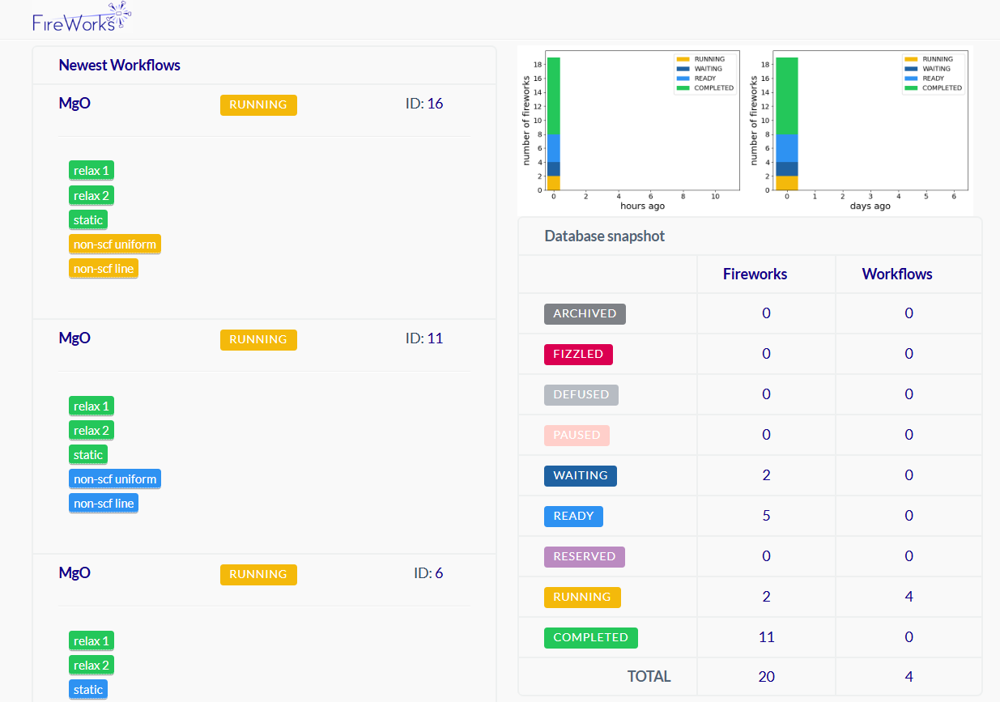

当我们回溯材料计算研究者的成长轨迹，会发现工作流管理工具的演进恰似一场层层突破的修行：

【启蒙阶段：刀耕火种】
 初入课题组时，导师递来的"葵花宝典"成为叩开计算材料学大门的密钥。VASP​ 手册里晦涩的INCAR参数，像一串等待破译的密码；在Linux终端反复调试的bash脚本，记录着与POSCAR较劲的日日夜夜。这个阶段的研究者如同匠人，用记事本雕琢每个计算任务，用肉眼比对OUTCAR中的能量收敛曲线。

【进阶工具：批量觉醒】
 当pymatgen​ 的Structure对象开始替代手工建模，当ASE的Atoms模块实现晶格参数的自动化调整，研究者终于挣脱了重复劳动的枷锁。笔者仍记得第一次用pymatgen​ 批量处理200个分子吸附构型时的震撼——原本需要数周的建模工作，在Python脚本的魔法下仅需一杯咖啡的时间。

【自动化跃迁：流程封装】
 ​Atomate2​ 的出现如同打开潘多拉魔盒，将DFT计算分解成可复用的"乐高模块"：结构优化→静态计算→能带分析。Jobflow​ 的DAG（有向无环图）引擎更让任务编排突破线性束缚，当我们在超算平台同时提交50个掺杂体系的电子结构计算时，忽然意识到计算流程已从"流水线作业"进化到"智能工厂"模式。

【终极归属：工作流交响】
 而FireWorks​ 的登场，才真正奏响了高通量计算的交响乐章。通过三大创新重构了计算范式：

1. 状态机架构：每个计算任务被抽象为Firework对象，其状态变迁（待运行→执行中→完成/失败）由LaunchPad统一调度
2. 容错重生：当某个节点因超算队列波动失败时，智能重试机制能自动续接断点，配合MongoDB的持久化存储确保流程韧性
3. 多尺度融合：通过自定义的FWAction机制，轻松实现第一性原理计算→机器学习势训练→分子动力学模拟的跨尺度串联

在FireWorks 的世界里，材料基因组计划的宏愿变得触手可及。当我们用YAML文件定义好相图搜索工作流，看着成千上万个虚拟晶体结构在云端自动生成、计算、分析，最终汇聚成热力学稳定性图谱时，终于领悟到：这不只是工具的进化，更是研究范式的革命——从此，计算材料学家得以将心智从机械操作中解放，真正回归材料设计的本质思考。

FireWorks 是一个免费且开源的工作流管理软件，旨在定义、管理和执行复杂的工作流。用使用 Python、JSON 或 YAML 来定义工作流，这些工作流存储在 MongoDB 数据库中，并可通过内置的 Web 界面进行监控。

主要功能：

1. 灵活的接口：FireWorks 提供了简洁灵活的 Python API、强大行界面，以及用于监控工作流的内Web 服务。这种多样化的接口使用户能够根据自身需求选择最适合的方FireWorks 交互。

1. 数端： 通过 MongoDB 数据库，用户可以添加、删除和搜索工作流的状态。这种数据库支持使得工作流管理更加高效和有序。
2. 故障检测与重试：FireWorks 能够检测到流中的软故障和硬故障，并根据需要重新运行失败的任务，确保工作流的可靠性和稳定性。
3. 多种执行模式：支持在多核机器上直接执行或通过队列系统执行，既可以机器上运行，也可以在多台机器上。用户可以为任务分配优先级，并指定任务的运行位置，以满足不同的计算需求。
4. 动态工作流： FireWorks 支持根过程中的情况，自动修改自身或创建新的流。这种动态调整能力使得工作流能够适应变化的需求和条件。
5. 自动处理重复任务：工作流级别，FireWorks 能够自动跳过重复的部分，仅运行独特的部分，提高了执行效率。
6. 内置任务： 提于创建模板化输入、运行脚本以及将文件到远程机器的内置任务，简化了常见操作的执行。
7. 远程文件状态跟踪： 在执行过程中户可以远程跟踪输出文件的状态，方便监控和调试。
8. 任务打包： 能够将许多小任务打包成一个大任务，自动在 100 个核心上并行运行 100 个串行工作流，提高资源利用率。
9. 队列系统支持： 支持多种队列系统，如 PBS/Torque、Sun Grid EnginLURM 和 IBM LoLeveler，适应不同的计算环境。

工作流模型： 在 FireWorks 中，工作以下三个主要组件组成：

- Firetask： 这是一个原子计算任务，可以调用shell 脚本或执行用户定义的 thon 函数。
- Firework： 包含执行任务所需的 JSON 规范，包括要按顺序执行的 Fireta数组，以及传递给 Firetask输入参数。
- Workflow： 由多个 Firework 组成，并定义它们之间的依赖关系，例如，某个父级 Firework 完成并生文，才能运行其子级 Firework。

通过这些组件，用户可以构杂且动态的工作流，以满足各种计算需求。
