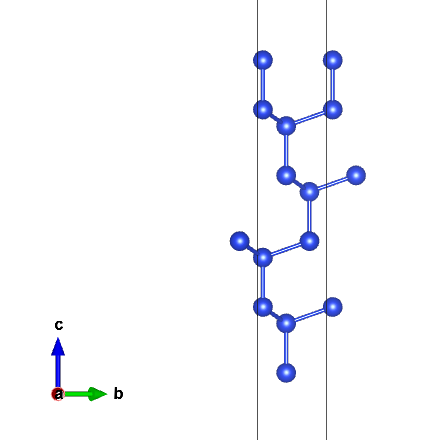
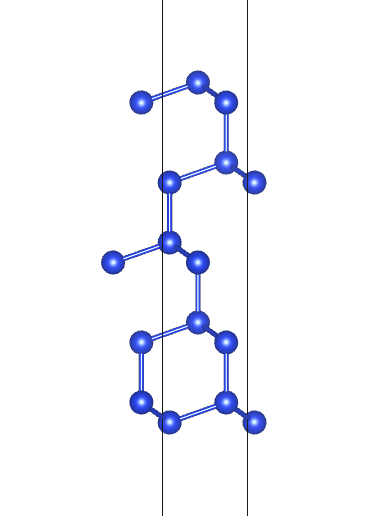
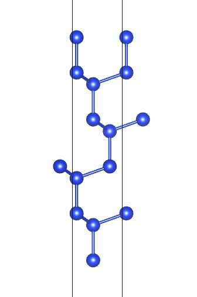

***¡Hola a todos!***

本章介绍如何构建`slab`模型。

首先切面用到的`miller index`针对的是`bulk`模型的惯用胞（`conventional cell`）而不是原胞（`primtive cell`），这与之前计算能带是刚好相反的。

所以，在进行切面操作时，要确保你的`bulk`模型是惯用胞，可以用`pymatgen`的功能来帮助实现。

- 直接从`Materials project`下载结构

如果是从`MP`上下载结构，我们需要把`conventional_cell = True`打开：

```python
from mp_api.client import MPRester

api_key = "your key"

with MPRester(api_key) as mpr:
    Si = mpr.get_structure_by_material_id("mp-149",conventional_unit_cell=True)
    Si.to(filename="./Si_conventional.cif")
```

这样确保你下载的结构是惯用胞。

- 原胞转化为惯用胞

也可以通过转化来确保使用的是惯用胞：

```python
from pymatgen.core.structure import Structure
from pymatgen.symmetry.analyzer import SpacegroupAnalyzer

structure = Structure.from_file("./Si_primtive.cif")
analyzer = SpacegroupAnalyzer(structure)
print(f'old structure: \n {structure}')
print('\n')
new_structure = analyzer.get_conventional_standard_structure()
print(f'new structure: \n {new_structure}')
```

`new_structure`对应的就是惯用胞结构。运行代码：

```text
old structure: 
 Full Formula (Si2)
Reduced Formula: Si
abc   :   3.849278   3.849279   3.849278
angles:  60.000012  60.000003  60.000011
pbc   :       True       True       True
Sites (2)
  #  SP        a      b      c
---  ----  -----  -----  -----
  0  Si    0.875  0.875  0.875
  1  Si    0.125  0.125  0.125


new structure: 
 Full Formula (Si8)
Reduced Formula: Si
abc   :   5.443702   5.443702   5.443702
angles:  90.000000  90.000000  90.000000
pbc   :       True       True       True
Sites (8)
  #  SP       a     b     c
---  ----  ----  ----  ----
  0  Si    0.75  0.75  0.25
  1  Si    0     0.5   0.5
  2  Si    0.75  0.25  0.75
  3  Si    0     0     0
  4  Si    0.25  0.75  0.75
  5  Si    0.5   0.5   0
  6  Si    0.25  0.25  0.25
  7  Si    0.5   0     0.5
```

或者你不知道自己的结构到底是原胞还是惯用胞，可以无脑直接转换，因为对于本身就是惯用胞的结构，`get_conventional_standard_structure()`方法不会修改本身的信息：

```python
from pymatgen.core.structure import Structure
from pymatgen.symmetry.analyzer import SpacegroupAnalyzer

# 读取本身是惯用胞的结构
structure = Structure.from_file("./Si_conventional.cif")
analyzer = SpacegroupAnalyzer(structure)
print(f'old structure: \n {structure}')
print('\n')
new_structure = analyzer.get_conventional_standard_structure()
print(f'new structure: \n {new_structure}')
```

结果不变，运行代码：

```txt
old structure: 
 Full Formula (Si8)
Reduced Formula: Si
abc   :   5.443702   5.443702   5.443702
angles:  90.000000  90.000000  90.000000
pbc   :       True       True       True
Sites (8)
  #  SP       a     b     c
---  ----  ----  ----  ----
  0  Si    0.75  0.75  0.25
  1  Si    0     0.5   0.5
  2  Si    0.75  0.25  0.75
  3  Si    0     0     0
  4  Si    0.25  0.75  0.75
  5  Si    0.5   0.5   0
  6  Si    0.25  0.25  0.25
  7  Si    0.5   0     0.5


new structure: 
 Full Formula (Si8)
Reduced Formula: Si
abc   :   5.443702   5.443702   5.443702
angles:  90.000000  90.000000  90.000000
pbc   :       True       True       True
Sites (8)
  #  SP       a     b     c
---  ----  ----  ----  ----
  0  Si    0.25  0.75  0.75
  1  Si    0     0     0
  2  Si    0.25  0.25  0.25
  3  Si    0     0.5   0.5
  4  Si    0.75  0.75  0.25
  5  Si    0.5   0     0.5
  6  Si    0.75  0.25  0.75
  7  Si    0.5   0.5   0
```

**Note**：上述方法对于缺陷结构和掺杂结构，由于对称性无法识别可能无法转化。

### SlabGenerator模块

进入正题，切面主要用到`pyamtgen`的`SlabGenerator`模块，首先导入它：

```python
from pymatgen.core.surface import SlabGenerator
```

然后需要先实例化`SlabGenetator`，才能调用里面的切面方法：

```python
from pymatgen.core.surface import SlabGenerator
from pymatgen.core.structure import Structure

Si = Structure.from_file("./Si_conventional.cif")

# 实例化
slabgen = SlabGenerator(
    initial_structure=Si,		# 初始结构
    miller_index=(1, 1, 1),		# 指定晶面
    min_slab_size=15,			# slab厚度
    min_vacuum_size=20,			# 真空层厚度
    in_unit_planes=False,		# 切换 min_slab_size & min_vacuum_size
    center_slab=True,			# slab模型居中
    primitive=True,				# 使用最小切面结构
    reorient_lattice=True,		# 重定向晶格
)
```

这里着重介绍`in_unit_planes`和`primitive`参数。

- `in_unit_planes`：影响`min_slab_size`和`min_vacuum_size`的数值，默认为`False`。

  - 当为`False`时，`min_slab_size`和`min_vacuum_size`对应的单位为`Angstrom `，即上述分别表示`slab`厚度为10埃，真空层厚度为15埃；

  - 当为`True`时，数值为切面的层数，如此时`min_slab_size`和`min_vacuum_size`都设置为3，表示slab厚度和真空层厚度为(1,1,1)面最小重复单元乘以3。需要注意的是，此时数字`3`并不等于原子层数，且不同晶面的最小重复单元的厚度不一样，如`Si`的(1,1,1)面单层厚度是小于(1,0,0)面的。

- `primitive`：默认为True。该参数跟`primitive cell`没有关系，在这里是决定`slab`结构是否选取最小单元。当设置为`True`时，如1x1x1的`Si`惯用胞结构和3x3x3超胞的`Si`惯用胞结构，最后得到的`slab`结构是一样。

`SlabGenerator`下面有许多切面的方法，下面一一介绍。

#### get_slab()方法

`get_slab()`方法用于生成指定暴露面原子的`slab`结构，传入`shift`参数来指定原子。该方法不建议直接使用，前提你需要确定shift的值。对于垂直于坐标轴的切面，`shift`值对应的分别就是abc的坐标，但是其他晶面情况就需要简单的运算之后才能够得到`shift`值。代码如下：

```python
from pymatgen.core.surface import SlabGenerator
from pymatgen.core.structure import Structure

Si = Structure.from_file("./Si_conventional.cif")

slabgen = SlabGenerator(
    initial_structure=Si,
    miller_index=(1, 1, 1),
    min_slab_size=15,
    min_vacuum_size=20,
    in_unit_planes=False,
    center_slab=True,
    primitive=True,
    reorient_lattice=True,
)
# 生成表面
slab = slabgen.get_slab(shift=0)
# 保存结构
slab.to("./Si_111_getslab.cif")
```

`vesta`里面查看结构：



`slab`厚度和真空层厚度可根据上述方法自行调整。

#### get_slabs()方法

`get_slabs()`支持生成所有符合要求的`slab`，接受传入的参数也要比`gen_slab()`多，主要有：

- `bonds`：设置成键范围。通俗的讲就是保护指定原子键对，避免断键。如`LiFePO4`中要保护`PO4`基团不被切断键，可以设置`bonds={(“P”, “O”): 3}`，这样就告诉`pymatgen`，3埃范围内的`P`原子和`O`原子维持成键，切面时就会避开`PO4`断键了。
- `max_broken_bonds`：自动切表面时，最大断键数，默认为0。建议不要主动设置，对于复杂结构，会导致切出的`slabs`数量急增。
- `repair`：自动补齐暴露面断键原子，默认`False`。也建议不要设置，会生成许多不可理的结构。

```python
from pymatgen.core.surface import SlabGenerator
from pymatgen.core.structure import Structure

Si = Structure.from_file("./Si_conventional.cif")

slabgen = SlabGenerator(
    initial_structure=Si,
    miller_index=(1, 1, 1),
    min_slab_size=15,
    min_vacuum_size=20,
    in_unit_planes=False,
    center_slab=True,
    primitive=True,
    reorient_lattice=True,
)
# 生成所有表面
slabs = slabgen.get_slabs()
# 打印结构信息
print([slab for slab in slabs])
# 保存结构
for i, slab in enumerate(slabs):
    slab.to(f"Si_111_getslabs_{i}.cif") 
```

运行代码：

```text
[Structure Summary
Lattice
    abc : 3.8492788605882793 3.8492788605882797 37.715076344492445
 angles : 90.0 90.0 120.00000000000001
 volume : 483.9543213850744
      A : 3.8492788605882793 0.0 2.3570035178225037e-16
      B : -1.9246394302941412 3.333573279519868 2.3570035178225037e-16
      C : 0.0 0.0 37.715076344492445
    pbc : True True True
PeriodicSite: Si (3.368, 0.2778, 12.18) [0.9167, 0.08333, 0.3229]
PeriodicSite: Si (-0.4812, 2.5, 12.96) [0.25, 0.75, 0.3438]
PeriodicSite: Si (-0.4812, 2.5, 15.32) [0.25, 0.75, 0.4063]
PeriodicSite: Si (1.443, 1.389, 16.11) [0.5833, 0.4167, 0.4271]
PeriodicSite: Si (1.443, 1.389, 18.46) [0.5833, 0.4167, 0.4896]
PeriodicSite: Si (3.368, 0.2778, 19.25) [0.9167, 0.08333, 0.5104]
PeriodicSite: Si (3.368, 0.2778, 21.61) [0.9167, 0.08333, 0.5729]
PeriodicSite: Si (-0.4812, 2.5, 22.39) [0.25, 0.75, 0.5938]
PeriodicSite: Si (-0.4812, 2.5, 24.75) [0.25, 0.75, 0.6563]
PeriodicSite: Si (1.443, 1.389, 25.54) [0.5833, 0.4167, 0.6771], 

Structure Summary
Lattice
    abc : 3.8492788605882793 3.8492788605882797 37.715076344492445
 angles : 90.0 90.0 120.00000000000001
 volume : 483.9543213850744
      A : 3.8492788605882793 0.0 2.3570035178225037e-16
      B : -1.9246394302941412 3.333573279519868 2.3570035178225037e-16
      C : 0.0 0.0 37.715076344492445
    pbc : True True True
PeriodicSite: Si (1.443, 1.389, 13.75) [0.5833, 0.4167, 0.3646]
PeriodicSite: Si (1.443, 1.389, 11.39) [0.5833, 0.4167, 0.3021]
PeriodicSite: Si (3.368, 0.2778, 16.89) [0.9167, 0.08333, 0.4479]
PeriodicSite: Si (3.368, 0.2778, 14.54) [0.9167, 0.08333, 0.3854]
PeriodicSite: Si (-0.4812, 2.5, 20.04) [0.25, 0.75, 0.5313]
PeriodicSite: Si (-0.4812, 2.5, 17.68) [0.25, 0.75, 0.4688]
PeriodicSite: Si (1.443, 1.389, 23.18) [0.5833, 0.4167, 0.6146]
PeriodicSite: Si (1.443, 1.389, 20.82) [0.5833, 0.4167, 0.5521]
PeriodicSite: Si (3.368, 0.2778, 26.32) [0.9167, 0.08333, 0.6979]
PeriodicSite: Si (3.368, 0.2778, 23.96) [0.9167, 0.08333, 0.6354]]
```

`get_slabs()`自动切出所有的表面，根据输出信息可以发现根据原子排布不同`Si`(1,1,1)面有两种暴露面：





#### 补充

`pymatgen`切面有时候`slab`c方向不是正交的，即γ角不为90°。此时可以调用`get_orthogonal_c_slab()`方法进行矫正即可，用法为直接在`slab`对象调用即可：

```python
......
# SlabGenerator生成表面
slab = slabgen.get_slab()
# 正交转化
slab.get_orthogonal_c_slab()
print()
```

***¡Muchas gracias!***
