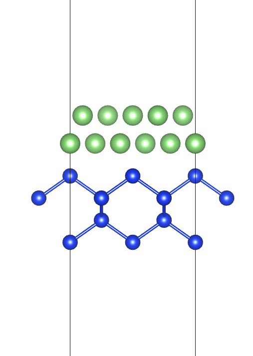
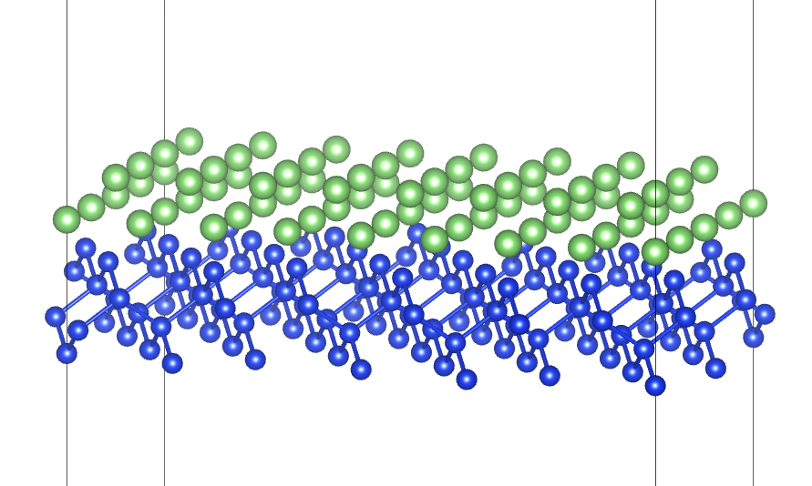

***¡Hola a todos!***

本章介绍如何自动构建异质结模型。

### CoherentInterfaceBuilder & ZSLGenerator

`pymatgen`中自动构建异质结模型需要调用`CoherentInterfaceBuilder`和`ZSLGenerator`。其中前者是用于生成`interfaces`，而后者主要是用于定义晶面的匹配度。导入方法为：

```python
from pymatgen.analysis.interfaces.coherent_interfaces import CoherentInterfaceBuilder
from pymatgen.analysis.interfaces.zsl import ZSLGenerator
```

首先介绍`ZSLGenerator`，原理见：[Lattice match: An application to heteroepitaxy](https://doi.org/10.1063/1.333084)。

`ZSLGenetator`接受四个参数传入：

- `max_area_ratio_tol`：上下表面面积最大公差，默认为0.09；
- `max_area`：最大表面面积，默认为400$Å^2$；
- `max_length_tol`：超晶格最大公差，默认0.03；
- `max_angle_tol`：上下表面基矢角度最大公差，默认0.01；

`CoherentInterfaceBuilder`接受五个参数传入：

- `substrate_structure`：基底结构；
- `film_structure`：表层结构；
- `film_miller`：表层结构米勒指数；
- `substrate_miller`：基底结构米勒指数；
- `zslgen`：`ZSLGenerator`

以`Si`与`Li`为例，构建异质结模型。下载对应结构：

```python
from pymatgen.core.structure import Structure
from mp_api.client import MPRester

api_key = "your key"

with MPRester(api_key) as mpr:
    Si = mpr.get_structure_by_material_id("mp-149", conventional_unit_cell=True)
    Li = mpr.get_structure_by_material_id("mp-135", conventional_unit_cell=True)
    Si.to(filename="./Si_convention.cif")
    Li.to(filename="./Li_convention.cif")
```

生成`Si(100)/Li(100)`异质结：

```python
from pymatgen.analysis.interfaces.coherent_interfaces import CoherentInterfaceBuilder
from pymatgen.analysis.interfaces.zsl import ZSLGenerator
from pymatgen.core.structure import Structure

# 结构
substratrate_Si = Structure.from_file("./Si_conventional.cif")
film_Li = Structure.from_file("./Li_convention.cif")

# 实例化
cib = CoherentInterfaceBuilder(
    substrate_structure=substratrate_Si,
    film_structure=film_Li,
    film_miller=([1,0,0]),
    substrate_miller=([1,0,0]),
    zslgen=ZSLGenerator(),
)

# 生成表面
interfaces = cib.get_interfaces(
    termination=cib.terminations[0], 	# 上下层结构暴露面
    gap=2.0, 							# 异质结间距
    vacuum_over_film=20.0, 				# 真空层厚度
    film_thickness=2, 					# 表层结构厚度
    substrate_thickness=4, 				# 基底结构厚度
    in_layers=True						
)
```

这里在实例化`CoherentInterfaceBuilder`之后调用`get_interfaces()`生成所有符合条件的异质结结构。`get_interfaces()`接受六个传入参数：

- `termination`：上下表面的端面。注意该参数有固定写法，可以调用`cib.terminations`查看`Si(100)/Li(100)`端面种类

  ```python
  ......
  print(cib.terminations)
  ```

  > 运行代码输出端面的列表`[('Li_P4/mmm_1', 'Si_P4/mmm_1')]`

  **Note**：`get_interfaces()`中`termination`支持的数据格式为元组，所以这里用`cib.terminations[0]`来进行调用，或者直接写`termination=('Li_P4/mmm_1', 'Si_P4/mmm_1')`。

- `gap`：异质结上下表面间距；
- `vacuum_over_film`：真空层厚度，这里指上下表面之间的真空层；
- `film_thickness`&`substrate_thickness`：上下`slab`厚度；
- `in_layers`：`slab`厚度用晶面厚度为单位，默认为`True`

继续，得到所有的结构：

```python
from pymatgen.analysis.interfaces.coherent_interfaces import CoherentInterfaceBuilder
from pymatgen.analysis.interfaces.zsl import ZSLGenerator
from pymatgen.core.structure import Structure

# 结构
substratrate_Si = Structure.from_file("./Si_conventional.cif")
film_Li = Structure.from_file("./Li_convention.cif")

# 实例化
cib = CoherentInterfaceBuilder(
    substrate_structure=substratrate_Si,
    film_structure=film_Li,
    film_miller=([1,0,0]),
    substrate_miller=([1,0,0]),
    zslgen=ZSLGenerator(),
)

# 生成表面
interfaces = cib.get_interfaces(
    termination=cib.terminations[0], 	# 上下层结构暴露面
    gap=2.0, 							# 异质结间距
    vacuum_over_film=20.0, 				# 真空层厚度
    film_thickness=2, 					# 表层结构厚度
    substrate_thickness=4, 				# 基底结构厚度
    in_layers=True						
)

count = 0
for i, interface in enumerate(interfaces):
    print(f"Interface {i}:")
    print(interface)
    count += 1
print(f"Total number of interfaces: {count}")
```

运行代码：

```txt
Interface 0:
Full Formula (Li10 Si16)
Reduced Formula: Li5Si8
abc   :   7.698558   7.698558  27.802433
angles:  90.000000  90.000000  90.000000
pbc   :       True       True       True
Sites (26)
  #  SP       a     b         c    bulk_equivalent  bulk_wyckoff    interface_label
---  ----  ----  ----  --------  -----------------  --------------  -----------------
  0  Li    0     0     0.577558                  0  a               film
  1  Li    0.4   0.2   0.577558                  0  a               film
  2  Li    0.2   0.6   0.577558                  0  a               film
  3  Li    0.8   0.4   0.577558                  0  a               film
  4  Li    0.6   0.8   0.577558                  0  a               film
  5  Li    0.1   0.3   0.639411                  0  a               film
  6  Li    0.5   0.5   0.639411                  0  a               film
  7  Li    0.3   0.9   0.639411                  0  a               film
  8  Li    0.9   0.7   0.639411                  0  a               film
  9  Li    0.7   0.1   0.639411                  0  a               film
 10  Si    0     0.25  0.407722                  0  a               substrate
 11  Si    0     0.75  0.407722                  0  a               substrate
 12  Si    0.5   0.25  0.407722                  0  a               substrate
 13  Si    0.5   0.75  0.407722                  0  a               substrate
 14  Si    0     0.5   0.358772                  0  a               substrate
 15  Si    0     0     0.358772                  0  a               substrate
 16  Si    0.5   0.5   0.358772                  0  a               substrate
 17  Si    0.5   0     0.358772                  0  a               substrate
 18  Si    0.25  0.5   0.505622                  0  a               substrate
 19  Si    0.25  0     0.505622                  0  a               substrate
 20  Si    0.75  0.5   0.505622                  0  a               substrate
 21  Si    0.75  1     0.505622                  0  a               substrate
 22  Si    0.25  0.25  0.456672                  0  a               substrate
 23  Si    0.25  0.75  0.456672                  0  a               substrate
 24  Si    0.75  0.25  0.456672                  0  a               substrate
 25  Si    0.75  0.75  0.456672                  0  a               substrate
 ......
 ......
 Total number of interfaces: 191
```

符合要求的`interfaces`总共有191个。`interfaces`的类型是一个迭代器，不能直接调用输出其中的结果，但是可以先转化成`list`，然后可以导出第一个结构看下结果：

```python
......
# 转化成列表
Interfaces = list(interfaces)
# 输出第一个结构
Interfaces[0].to("./Heter_1.cif")
```

`VESTA`打开：



可以再输出最后一个结构对比一下：

```python
......
# 转化成列表
Interfaces = list(interfaces)
# 输出最后一个结构
Interfaces[190].to("./Heter_191.cif")
```

`VESTA`打开：



可以发现同样的情况下，最后一个结构整体结构要大很多，相对更复杂。

这是因为`Interfaces`里储存的结构是根据结构从简单到复杂进行排列，这里的"复杂"对应的是程序为了搜索匹配的超晶格表面，会自动进行晶格重定向或晶格基矢转变来进行匹配。

实际使用时，为了节省计算时间，推荐选取最靠前的几个结构进行计算即可。

***¡Muchas gracias!***
