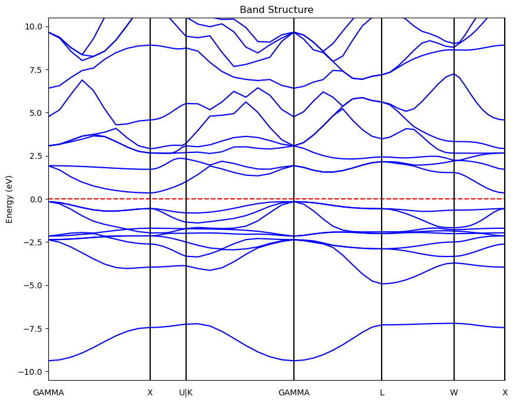
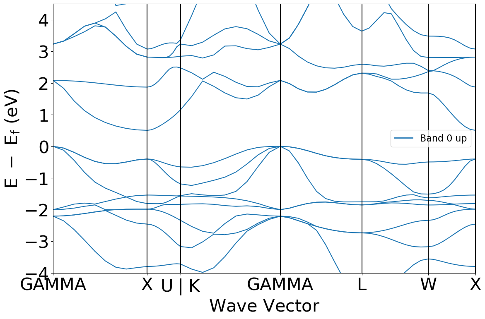
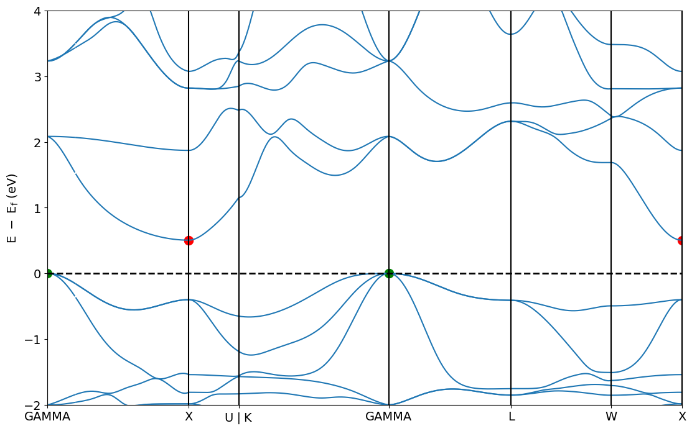

***¡Hola a todos!***

本章介绍如何分析能带计算结果。

### 导出gap/CBM/VBM信息

能带计算完后，直接读取`vasprun.xml`文件，可以最快的得到禁带宽度、CBM/VBM的数值，以及半导体种类（直接带隙/间接带隙）。代码如下：

```python
from pymatgen.io.vasp.outputs import Vasprun
import pandas as pd

# 读vasprun.xml文件
vasprun = Vasprun("../ZrNiSn_primitive/band/vasprun.xml")
# 获取gap/vbm/cbm
bandgap_dict = vasprun.get_band_structure().get_band_gap()
vbm = vasprun.get_band_structure().get_vbm()["energy"]
cbm = vasprun.get_band_structure().get_cbm()["energy"]
# 添加到数据框中
bandgap = pd.DataFrame([bandgap_dict])
bandgap["VBM"] = vbm
bandgap["CBM"] = cbm

print(bandgap)
```

运行代码可输出如下表格的信息：

| direct | energy | transition | VBM   |  CBM   |
| :----: | ------ | ---------- | ----- | :----: |
| False  | 0.5059 | GAMMA-X    | 8.489 | 8.9949 |

从左至右分别为：是否为直接带隙、禁带宽度、VBM/CBM指向、VBM能量、CBM能量。

还可以用`BandStructure`类同样可以得到类似信息：

```python
from pymatgen.io.vasp.outputs import Vasprun
from pymatgen.electronic_structure.bandstructure import BandStructure

# 读vasprun.xml文件
vasprun = Vasprun("../ZrNiSn_primitive/band/vasprun.xml")

band = BandStructure.from_dict(vasprun.get_band_structure().as_dict())

print(band.get_band_gap())
```

### 导出能量本征值

还可以直接得到每条能带的能量本征值：

```python
from pymatgen.io.vasp.outputs import Vasprun
from pymatgen.electronic_structure.bandstructure import BandStructure
from pymatgen.electronic_structure.core import Spin, Orbital
import pandas as pd

# 读vasprun.xml文件
vasprun = Vasprun("../ZrNiSn_primitive/band/vasprun.xml")

band = BandStructure.from_dict(vasprun.get_band_structure().as_dict())

# 输出自旋向上能量本征值
eigenvalues = pd.DataFrame(band.bands[Spin.up])
print(eigenvalues)
eigenvalues.to_csv("eigenvalues.csv")
```

得到的数据格式索引符合`[band_index, kpoint_index]`。

### 导出完整的能带数据

除了一些特殊的需求，最重要的还是想要得到能带图，那么下面提供的代码就可以用来得到源数据用于绘图：

```python
from pymatgen.io.vasp import Vasprun
from pymatgen.electronic_structure.core import Spin
import pandas as pd

# 读取 vasprun.xml 文件
vasprun = Vasprun("../ZrNiSn_primitive/band/vasprun.xml")

# 提取能带结构
band_structure = vasprun.get_band_structure(line_mode=True)
# 获取 k 点数据
kpoints = band_structure.kpoints
# 选择自旋通道
selected_spin = Spin.up  # 或者 Spin.down，根据你需要的自旋通道选择
# 获取指定自旋通道的能带数据
energies = band_structure.bands[selected_spin]
# 获取费米能级
fermi_level = band_structure.efermi
# 准备存储数据
data = []

# 遍历每个能带和 k 点，提取能量信息
for band_index, band in enumerate(energies):
    for kpoint_index, energy in enumerate(band):
        if kpoint_index < len(kpoints):  # 防止索引超出范围
            kpoint_coords = kpoints[kpoint_index].frac_coords  # 获取 k 点的坐标
            kpoint_label = kpoints[kpoint_index].label  # 获取 k 点的标签（如有）
            kpoint_distance = band_structure.distance[kpoint_index]  # k 点在路径上的距离

            # 如果 k 点有标签，使用标签；否则使用坐标
            if kpoint_label:
                kpoint_info = kpoint_label
            else:
                kpoint_info = ','.join(map(str, kpoint_coords))

            # 将数据添加到列表中
            data.append({
                "spin": selected_spin.name,
                "kpoint": kpoint_info,
                "kpoint distance": kpoint_distance,
                "band index": band_index,
                "energy (eV)": energy - fermi_level  # 能量相对费米能级
            })

# 转换为 DataFrame
df = pd.DataFrame(data)
# 保存为 CSV 文件
csv_filename = f"band_structure_data_spin_{selected_spin.name}.csv"
df.to_csv(csv_filename, index=False)
```

运行代码可以得到如下格式的csv文件：

| spin | kpoints | kpoints distance | band index | energy(eV) |
| :--: | :-----: | :--------------: | :--------: | :--------: |
|  up  |  GAMMA  |        0         |     0      |  -63.5333  |
|  up  |   ...   |       ...        |    ...     |    ...     |
|  up  |   ...   |       ...        |    ...     |    ...     |

从左至右分别为：自旋方向，K点坐标，K点距离，第几条能带，能量本征值。

绘图时采用第三列为x轴，第五列为y轴，最后对应的横坐标位置标注对应的高对称点即可。

### matplotlib库绘图

根据上面得到的`band_structure_data_spin_up.csv`文件，我们可以用`matplotlib`库进行绘图，代码如下：

```python
import pandas as pd
import matplotlib.pyplot as plt

# 读取 CSV 文件
df = pd.read_csv("band_structure_data_spin_up.csv")  # 替换为你的 CSV 文件路径

# 提取唯一的能带索引
band_indices = df['band index'].unique()

# 创建绘图
plt.figure(figsize=(10, 8))

# 遍历每个能带，绘制对应的能带图
for band_index in band_indices:
    band_data = df[df['band index'] == band_index]
    plt.plot(band_data['k-point distance'], band_data['energy (eV)'], color='blue')  # 使用相同的颜色

# 添加图形标签和标题
plt.ylabel('Energy (eV)')
plt.title('Band Structure')
plt.axhline(y=0, color='r', linestyle='--',)  # 绘制费米能级线
plt.ylim(-10.5,10.5)
plt.xlim(df['k-point distance'].min(), df['k-point distance'].max())
plt.xticks([])

# 添加高对称点
high_symmetry_points = {
    0: "GAMMA",
    1.0245: "X",
    1.387: "U|K",
    2.473: "GAMMA",
    3.36: "L",
    4.085: "W",
    4.597: "X"
}

# 调整文本与坐标轴的间隙
gap = -0.5  # 你可以根据需要调整这个值

for position, point in high_symmetry_points.items():
    plt.axvline(x=position, color='black')
    plt.text(position, plt.ylim()[0] + gap, point, verticalalignment='top', horizontalalignment='center')

# 显示图形
plt.show()
```

运行代码：



该方法相对麻烦，不够自动化，还需要我们手动去提供高对称点参考线的字典，因此这里推荐另一种方法。

### BSPlotter方法绘图

`pymatgen`有可以直接处理能带计算`vasprun.xml`文件的模块——`pymatgen.electronic_structure.plotter.BSPlotter`，直接绘制能带结果图。代码如下：

```python
from pymatgen.electronic_structure.plotter import BSPlotter
from pymatgen.io.vasp.outputs import Vasprun

# 读取 vasprun.xml 文件
vasprun = Vasprun("../ZrNiSn_primitive/band/vasprun.xml", parse_projected_eigen=True)
# 提取带结构
band = vasprun.get_band_structure(line_mode=True)
# 创建带结构绘图对象
bs_plotter = BSPlotter(band)
# 绘制带结构
bs_plotter.get_plot()
```

运行代码：



`BSPlotter`使用起来非常方便，只需要读取相应的`vasprun.xml`文件即可，然而也有不足的地方，默认输出的图片格式不太美观，字体过大。这里我们可以在`get_plot()`方法之后，修改`matplotlib`的属性进行覆盖即可，代码如下：

```python
from pymatgen.electronic_structure.plotter import BSPlotter
from pymatgen.io.vasp.outputs import Vasprun
import matplotlib.pyplot as plt

# 读取 vasprun.xml 文件
vasprun = Vasprun("../ZrNiSn_primitive/band/vasprun.xml", parse_projected_eigen=True)
# 提取带结构
band = vasprun.get_band_structure(line_mode=True)
# 创建带结构绘图对象
bs_plotter = BSPlotter(band)
# 生成带结构图，获取 Axes 对象
ax = bs_plotter.get_plot(ylim=[-2, 4], smooth=True, vbm_cbm_marker=True)

# 覆盖字体大小
fontsize = 14  # 你想要设置的字体大小
# 修改 x 和 y 轴标签的字体大小
ax.set_xlabel(ax.get_xlabel(), fontsize=fontsize)
ax.set_ylabel(ax.get_ylabel(), fontsize=fontsize)
# 修改 x 轴和 y 轴刻度标签的字体大小
ax.tick_params(axis='both', labelsize=fontsize)
# 添加费米能级参考线
ax.axhline(y=0, color='black', linestyle='--',linewidth=2)
# 移除图例
legend = ax.get_legend()
if legend is not None:
    legend.remove()
# 移除 x 轴标签
ax.set_xlabel('')

# 显示图形
plt.show()
```

运行代码：



现在看上去就顺眼了很多。单独绘制能带图的话，还是推荐使用`BSPlotter`方法，然后再修改

`matplotlib`的属性来覆盖`get_plot()`方法中的默认参数。


***¡Muchas gracias!***

