***¡Hola a todos!***

最近学习了一下`Pyprocar`的用法，分享一下使用心得。

对于老司机这种天生反骨的打工人，每天想的都是怎么偷懒，但是又想保住份工，就只能在效率上面想办法了，总之就是：

> **Be lazy, stay efficient, and enjoy your coffee break!**

## 介绍

[官网]([PyProcar — PyProcar 6.1.10 documentation (romerogroup.github.io)](https://romerogroup.github.io/pyprocar/))：

> ***PyProcar is a robust, open-source Python library used for pre- and post-processing of the electronic structure data coming from DFT calculations. PyProcar provides a set of functions that manage data from the PROCAR format obtained from various DFT codes. Basically, the PROCAR file is a projection of the Kohn-Sham states over atomic orbitals. That projection is performed to every 𝑘-point in the considered mesh, every energy band and every atom. PyProcar is capable of performing a multitude of tasks including plotting plain and spin/atom/orbital projected band structures and Fermi surfaces- both in 2D and 3D, Fermi velocity plots, unfolding bands of a super cell, comparing band structures from multiple DFT calculations, plotting partial density of states and generating a 𝑘-path for a given crystal structure.***

简而言之，自动出图，解放双手。而且对比其他后处理软件，老司机个人感觉`Pyprocar`出的图相对来说已经比较好看了，作为工作狗来说妥妥够用不需要二次处理了；放在顶刊文章里可能还需要再编辑下，不过还好`Pyprocar`提供了`matplotlib`再处理的功能，所以对图片要求更加高大上的也不用担心，再次编辑就行了。

## 处理能带

能带VASP计算流程参照参照`Learn VASP from pyamtgen`系列——[Chap.8 计算小白硬学VASP —— 材料性质计算—>能带计算 - A&H (andyhox.github.io)](https://andyhox.github.io/2024/06/18/Learn-VASP-from-pymatgen-8/)，直接处理案例的数据。

### Pyprocar后处理

#### 普通能带

`Pyprocar`的代码非常简单，只需要简单设置就可以得到基本的能带图，主要用到的方法为`pyprocar.bandsplot`。

代码如下：

```python
import pyprocar
from pymatgen.io.vasp.outputs import Vasprun

# 读取vasprun.xml文件
vasprun = Vasprun('./ZrNiSn_primitive/band/vasprun.xml')
# 获取费米能级
efermi=vasprun.efermi
# 打印gap信息
print(vasprun.get_band_structure().get_band_gap())

band_dir = './ZrNiSn_primitive/band'
# pyprocar设置
pyprocar.bandsplot(
    code='vasp',		# 定义计算类型，默认为’vasp'
    dirname=band_dir,	# 指定文件路径，程序会自动读取对应文件
    mode='plain',		# 处理模式，'plain'为绘制普通band
)
```

运行代码：

首先调用`pymatgen`会输出gap信息：

> ***{'direct': False, 'energy': 0.5058999999999987, 'transition': 'GAMMA-X'}***

结构为间接半导体，**VBM→CBM**方向为：**GAMMA→X**，禁带宽度为：**0.5 eV**

默认参数输出的能带图：

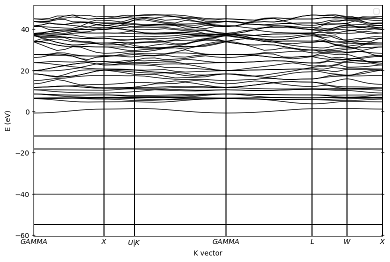

ok，此时的能带图初见轮廓但是不利于分析。默认参数下没有平移费米能级至0，已经选择合适的energy interval，所以我们需要优化一下：

```python
import pyprocar
from pymatgen.io.vasp.outputs import Vasprun

# 读取vasprun.xml文件
vasprun = Vasprun('./ZrNiSn_primitive/band/vasprun.xml')
# 获取费米能级
efermi=vasprun.efermi
# 打印gap信息
print(vasprun.get_band_structure().get_band_gap())

band_dir = './ZrNiSn_primitive/band'
# pyprocar设置
pyprocar.bandsplot(
    # 源参数
    code='vasp',		# 定义计算类型，默认为’vasp'
    dirname=band_dir,	# 指定文件路径，程序会自动读取对应文件
    mode='plain',		# 处理模式，'plain'为绘制普通band
    elimit=[-2,2],		# 指定Energy interval
    fermi=efermi,		# 提供费米能级，参数中提供费米能级后，默认会平移至0
    # 绘图参数
    linewidth=[2],		# 曲线宽度
    fermi_linewidth=2	# 费米能级参考线线宽
)
```

运行：

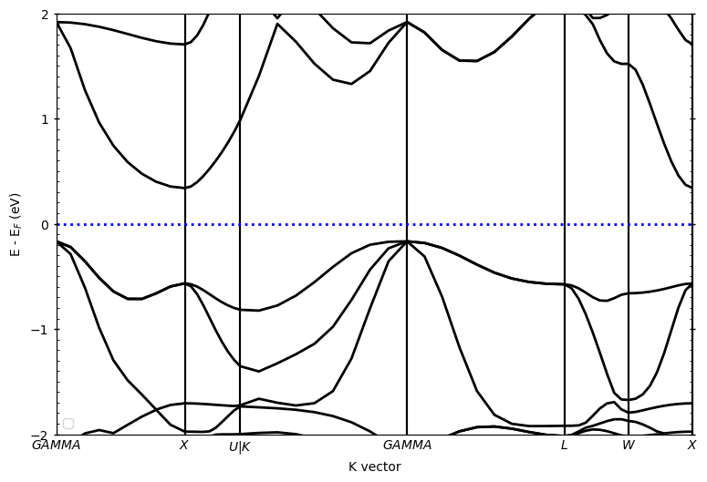

针对上述图片，我们增加了源参数：

- `elimit`：控制纵坐标能量范围；

- `fermi`：提供费米能级

源参数即`pyprocar.bandsplot`读取后输出对应的图，具体参数即含义可[参考文档]([PyProcar — PyProcar 6.1.10 documentation (romerogroup.github.io)](https://romerogroup.github.io/pyprocar/index.html))。参数有很多，但是实际操作中只需要设置几个参数就可以得到非常好的图了。

绘图参数是在此基础上调整图片的线宽，字体大小等，同样也只需要设置有限个参数就可以得到很好的图片了。



> spin_colors : {'description': 'The colors for the plot lines.', 'value': ['blue', 'red']}
>
> color : {'description': 'The colors for the plot lines.', 'value': 'black'}
>
> colorbar_title : {'description': 'Title of the colorbar.', 'value': 'Atomic Orbital Projections'}
>
> colorbar_title_size : {'description': 'Font size of the title of the colorbar.', 'value': 15}
>
> colorbar_title_padding : {'description': 'Padding of the title of the colorbar.', 'value': 20}
>
> colorbar_tick_labelsize : {'description': 'Size of the title of the colorbar ticks', 'value': 10}
>
> cmap : {'description': 'The colormap used for the plot.', 'value': 'jet'}
>
> clim : {'description': 'The color scale for the color bar', 'value': [None, None]}
>
> fermi_color : {'description': 'The color of the Fermi line.', 'value': 'blue'}
>
> fermi_linestyle : {'description': 'The linestyle of the Fermi line.', 'value': 'dotted'}
>
> fermi_linewidth : {'description': 'The linewidth of the Fermi line.', 'value': 1}
>
> grid : {'description': 'If true, a grid will be shown on the plot.', 'value': False}
>
> grid_axis : {'description': 'Which axis (or both) the grid lines should be drawn on.', 'value': 'both'}
>
> grid_color : {'description': 'The color of the grid lines.', 'value': 'grey'}
>
> grid_linestyle : {'description': 'The linestyle of the grid lines.', 'value': 'solid'}
>
> grid_linewidth : {'description': 'The linewidth of the grid lines.', 'value': 1}
>
> grid_which : {'description': 'Which grid lines to draw (major, minor or both).', 'value': 'major'}
>
> label : {'description': 'The labels for the plot lines.', 'value': ['$\\uparrow$', '$\\downarrow$']}
>
> legend : {'description': 'If true, a legend will be shown on the plot.', 'value': True}
>
> linestyle : {'description': 'The linestyles for the plot lines.', 'value': ['solid', 'dashed']}
>
> linewidth : {'description': 'The linewidths for the plot lines.', 'value': [1.0, 1.0]}
>
> marker : {'description': 'The marker styles for the plot points.', 'value': ['o', 'v', '^', 'D']}
>
> markersize : {'description': 'The size of the markers for the plot points.', 'value': [0.2, 0.2]}
>
> opacity : {'description': 'The opacities for the plot lines.', 'value': [1.0, 1.0]}
>
> plot_color_bar : {'description': 'If true, a color bar will be shown on the plot.', 'value': True}
>
> savefig : {'description': 'The file name to save the figure. If null, the figure will not be saved.', 'value': None}
>
> title : {'description': 'The title for the plot. If null, no title will be displayed.', 'value': None}
>
> weighted_color : {'description': 'If true, the color of the lines will be weighted.', 'value': True}
>
> weighted_width : {'description': 'If true, the width of the lines will be weighted.', 'value': False}
>
> figure_size : {'description': 'The size of the figure (width, height) in inches.', 'value': [9, 6]}
>
> dpi : {'description': "The resolution in dots per inch. If 'figure', use the figure's dpi value.", 'value': 'figure'}

#### 轨道投影能带图

##### 线性

`LORBIT`设置成12的话，轨道的分类如下：

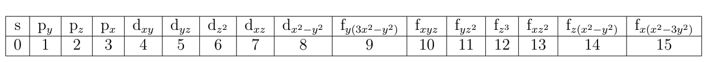

此时`pyprocar.bandsplot`中设置`mode=parametric`，同时也需要指定轨道：

- `orbitals=[1]`：只分析`py`亚轨道；
- `orbitals=[1,2,3]`：分析全部p轨道;
- 以此类推......

下面为primtive_cell的结果：



<!-- tab s轨道 -->

```python
import pyprocar
from pymatgen.io.vasp.outputs import Vasprun

# 读取vasprun.xml文件
vasprun = Vasprun('./ZrNiSn_primitive/band/vasprun.xml')
efermi = vasprun.efermi

band_dir = './ZrNiSn_primitive/band'

pyprocar.bandsplot(
    code='vasp',
    dirname=band_dir,
    mode='parametric',
    elimit=[-2,2],
    orbitals=[0],   # s轨道
    fermi=efermi,
    clim=[0,1],		# color bar的刻度
    linewidth=[2],
    fermi_linewidth=2
)
```

运行代码：

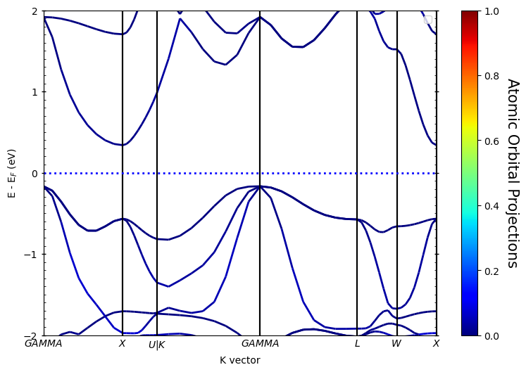

<!-- endtab -->

<!-- tab p轨道 -->

```python
import pyprocar
from pymatgen.io.vasp.outputs import Vasprun

# 读取vasprun.xml文件
vasprun = Vasprun('./ZrNiSn_primitive/band/vasprun.xml')
efermi = vasprun.efermi

band_dir = './ZrNiSn_primitive/band'

pyprocar.bandsplot(
    code='vasp',
    dirname=band_dir,
    mode='parametric',
    elimit=[-2,2],
    orbitals=[1,2,3],   # p轨道
    fermi=efermi,
    clim=[0,1],			# color bar的刻度
    linewidth=[2],
    fermi_linewidth=2
)
```

运行代码：

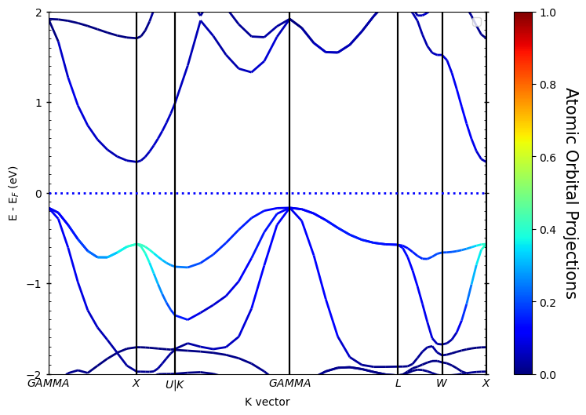

<!-- endtab -->

<!-- tab d轨道 -->

```python
import pyprocar
from pymatgen.io.vasp.outputs import Vasprun

# 读取vasprun.xml文件
vasprun = Vasprun('./ZrNiSn_primitive/band/vasprun.xml')
efermi = vasprun.efermi

band_dir = './ZrNiSn_primitive/band'

pyprocar.bandsplot(
    code='vasp',
    dirname=band_dir,
    mode='parametric',
    elimit=[-2,2],
    orbitals=[4,5,6,7,8],   # d轨道
    fermi=efermi,
    clim=[0,1],				# color bar的刻度
    linewidth=[2],
    fermi_linewidth=2
)
```

运行代码：


<!-- endtab -->



如果是对于自旋体系，在源参数中增加`spins`即可控制绘图考虑的自旋方向：

- `spins=[0]`：绘制spin up
- `spins=[1]`：绘制spin down
- `spins=[0,1]`：同时绘制spin up & spin down

老司机这里计算的时候把自旋关了，所以输出也就只有一条，不用额外设置。

除此之外，还可以输出原子的贡献，操作就是把`oribitals`换成`atoms`，如下：

```python
import pyprocar
from pymatgen.io.vasp.outputs import Vasprun

# 读取vasprun.xml文件
vasprun = Vasprun('./ZrNiSn_primitive/band/vasprun.xml')
efermi = vasprun.efermi

band_dir = './ZrNiSn_primitive/band'

pyprocar.bandsplot(
    code='vasp',
    dirname=band_dir,
    mode='parametric',
    elimit=[-2,2],
    atoms=[0],   			# 1号原子贡献
    fermi=efermi,
    clim=[0,1],				# color bar的刻度
    linewidth=[2],
    fermi_linewidth=2
)
```

运行代码：

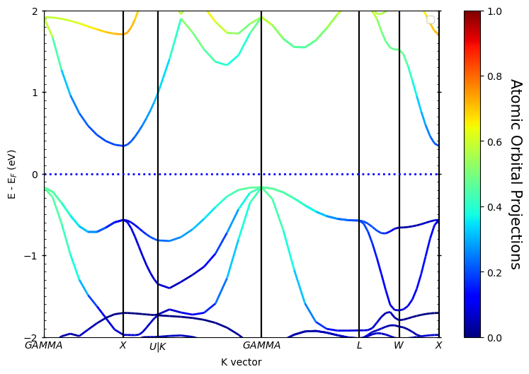

如果想得到某一元素的贡献，只需要在`atoms=[]`中包含同一元素原子所有的序号即可，上面计算用到的primtive cell中每个元素只有一个原子，即上图为`Zr`元素的贡献。

##### 散点

还可以用散点来表示，差别只是把`mode='parametric`'换成`mode='scatter'`，其余设置一样，如下：

```python
import pyprocar
from pymatgen.io.vasp.outputs import Vasprun

# 读取vasprun.xml文件
vasprun = Vasprun('./ZrNiSn_primitive/band/vasprun.xml')
efermi = vasprun.efermi

band_dir = './ZrNiSn_primitive/band'

pyprocar.bandsplot(
    code='vasp',
    dirname=band_dir,
    mode='scatter',
    elimit=[-2,2],
    atoms=[0],   			# 1号原子贡献
    fermi=efermi,
    clim=[0,1],				# color bar的刻度
    markersize=[60],		# 调整散点大小
    fermi_linewidth=2
)
```

运行代码：

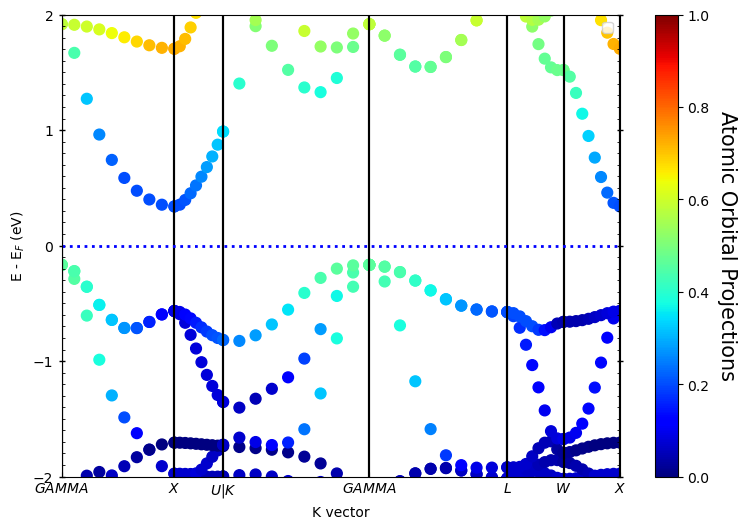

## 处理态密度

态密度的处理方法与能带类似，使用`pyprocar.dosplot`，VASP计算流程参照`Learn VASP from pyamtgen`系列——[Chap.5 计算小白硬学VASP —— 材料性质计算—>态密度 - A&H (andyhox.github.io)](https://andyhox.github.io/2024/06/11/Learn-VASP-from-pymatgen-5/)。

直接接着后处理上文`ZrNiSn`结构的态密度。

### Pyrocar 后处理

#### 总态密度TDOS

代码如下：

```python
import pyprocar
from pymatgen.io.vasp.outputs import Vasprun
from pymatgen.core.structure import Structure

# 读取vasprun.xml文件
prim_dos_vrun = Vasprun("./ZrNiSn_primitive/dos/vasprun.xml")
prim_efermi = prim_dos_vrun.efermi

prim_dos = pyprocar.dosplot(
    code='vasp',
    mode='plain',
    dirname='ZrNiSn_primitive/dos',
    fermi=prim_efermi,
    elimit=[-5,5],
    dos_limit=[0,50],
    )
```

运行代码：

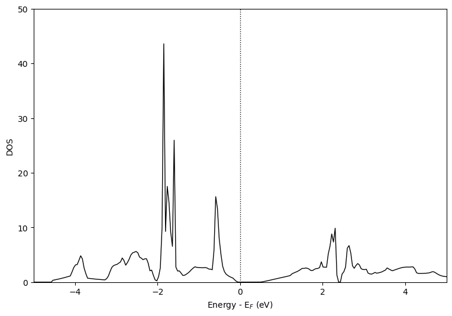

上述案例没有考虑`ISPIN`，故只显示一个方向。

#### 分态密度PDOS

##### 指定元素和轨道

这里可以绘制`ZrNiSn`中Zr-d、Ni-d、Sn-sp轨道，此时用到`mode=overlay`，同时也需要设置`items`指定元素及轨道。代码如下：

```python
import pyprocar
from pymatgen.io.vasp.outputs import Vasprun
from pymatgen.core.structure import Structure

# 读取vasprun.xml文件
prim_dos_vrun = Vasprun("./ZrNiSn_primitive/dos/vasprun.xml")
prim_efermi = prim_dos_vrun.efermi

# primtive_cell

prim_dos = pyprocar.dosplot(
    code='vasp',
    mode='overlay',
    dirname='ZrNiSn_primitive/dos',
    fermi=prim_efermi,
    items=dict(Zr=(4,5,6,7,8),Ni=(4,5,6,7,8),Sn=(0,1,2,3)),
    elimit=[-2,2],
    dos_limit=[0,50],
    )
```

运行代码：

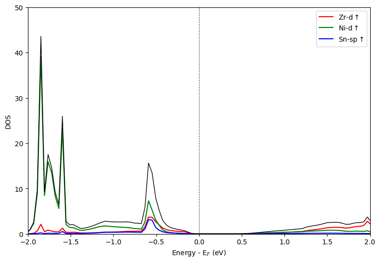

##### 分析指定原子的PDOS

如果需要分析指定编号单个原子或多个原子的PDOS，可以采用`mode=overlay_orbitals`方法，此时只需要指定`atoms`对应的原子序号列表，如这里分析Zr+Ni的PDOS。代码如下：

```python
import pyprocar
from pymatgen.io.vasp.outputs import Vasprun
from pymatgen.core.structure import Structure

# 读取vasprun.xml文件
prim_dos_vrun = Vasprun("./ZrNiSn_primitive/dos/vasprun.xml")
prim_efermi = prim_dos_vrun.efermi

# primtive_cell

prim_dos = pyprocar.dosplot(
    code='vasp',
    mode='overlay_orbitals',
    dirname='ZrNiSn_primitive/dos',
    fermi=prim_efermi,
    atoms=[0,1],
    elimit=[-2,2],
    dos_limit=[0,50],
    )
```

运行代码：

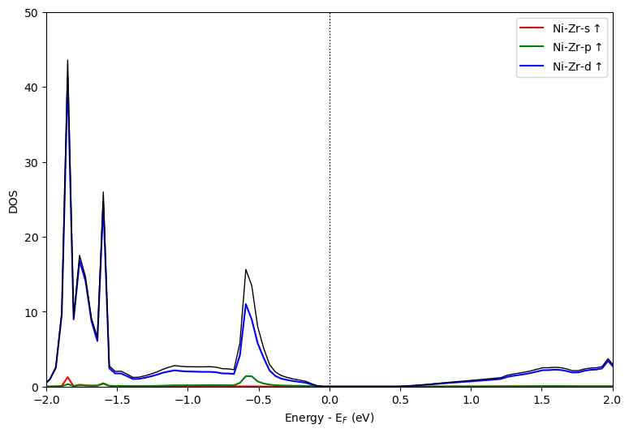

##### 指定所有元素同一个轨道

如果对于给定的体系需要分析所有元素的同一个轨道，比如过渡金属高熵合金只看d轨道的话，可以采用`mode=overlay_species`，且只需要指定`orbitals`即可。代码如下：

```python
import pyprocar
from pymatgen.io.vasp.outputs import Vasprun
from pymatgen.core.structure import Structure

# 读取vasprun.xml文件
prim_dos_vrun = Vasprun("./ZrNiSn_primitive/dos/vasprun.xml")
prim_efermi = prim_dos_vrun.efermi

# primtive_cell

prim_dos = pyprocar.dosplot(
    code='vasp',
    mode='overlay_species',
    dirname='ZrNiSn_primitive/dos',
    fermi=prim_efermi,
    orbitals=[4,5,6,7,8],
    elimit=[-2,2],
    dos_limit=[0,50],
    )
```

运行代码：

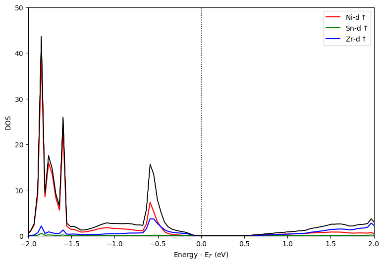


初次之外，图片还可以垂直的方式输出，只需要添加`orientation='vertical'`，如上述代码改为垂直输出：

```python
import pyprocar
from pymatgen.io.vasp.outputs import Vasprun
from pymatgen.core.structure import Structure

# 读取vasprun.xml文件
prim_dos_vrun = Vasprun("./ZrNiSn_primitive/dos/vasprun.xml")
prim_efermi = prim_dos_vrun.efermi

# primtive_cell

prim_dos = pyprocar.dosplot(
    code='vasp',
    mode='overlay_species',
    orientation='vertical',
    dirname='ZrNiSn_primitive/dos',
    fermi=prim_efermi,
    orbitals=[4,5,6,7,8],
    elimit=[-2,2],
    dos_limit=[0,50],
    )
```

运行代码：

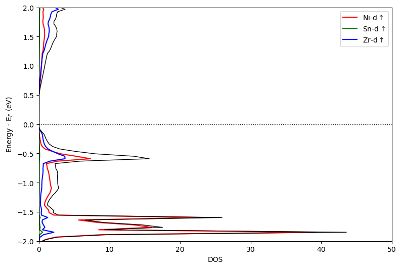

## 同时绘制能带态密度

用到`pyprocar.bandsdosplot`方法，只需要分别设置`band`和`dos`的参数，然后用`bandsdosplot`组合在一起即可，代码如下：

```python
import pyprocar
from pymatgen.io.vasp.outputs import Vasprun

# 读取vasprun.xml文件
prim_dos_vrun = Vasprun("./ZrNiSn_primitive/dos/vasprun.xml")
prim_efermi = prim_dos_vrun.efermi

bands_settings = {
                  'mode':'plain',
                  'fermi':prim_efermi, 
                  'dirname': bands_dir
                  }

dos_settings = {
               'mode':'plain',
               'fermi':prim_efermi,   
               'dirname': dos_dir
                }

pyprocar.bandsdosplot(code='vasp',
                bands_settings=bands_settings,
                dos_settings=dos_settings,
                )

```

运行代码：

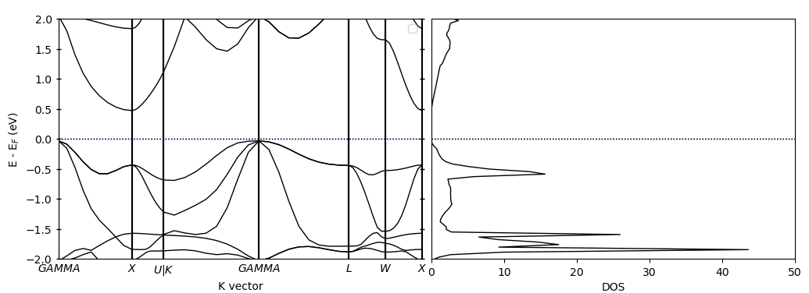

## 总结

`Pyprocar`的用法就介绍到这，欢迎补充！

***¡Muchas gracias!***
